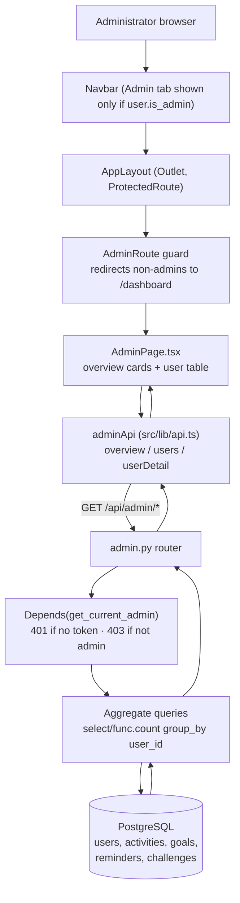

# Design Document: Admin Panel

## Overview

The Admin Panel adds an administrator-only view to HabitTrack that surfaces system-wide
usage statistics and a per-user usage breakdown. It is a read-only, aggregation-focused
feature: it does not create, mutate, or delete any user data.

The design reuses existing infrastructure rather than introducing new mechanisms:

- **Authorization** reuses the existing `get_current_admin` dependency in
  `app/middleware/middleware.py`, which builds on `get_current_user` (JWT validation) and
  raises `403` when `User.is_admin` is `false`. No new auth is invented. (Requirement 1)
- **Route style** follows the thin-controller pattern already used by
  `app/routes/dashboard.py` and `app/routes/settings.py`: Pydantic response models,
  async SQLAlchemy 2.0 `select`/`func.count` aggregate queries, and `Depends(get_db)`.
- **Frontend** follows the existing React 19 + react-router-dom 7 structure: a page under
  `src/pages/`, a typed API module in `src/lib/api.ts`, gating via the `useAuth` hook and
  the `is_admin` flag already present on `UserMe`.

Key design decisions and their rationale:

| Decision | Rationale | Requirement |
|----------|-----------|-------------|
| Reuse `get_current_admin` on every endpoint | Consistent 401/403 behavior, no duplicated auth logic | 1.1–1.4 |
| Grouped aggregate queries (`GROUP BY user_id`) merged in Python | Avoids N+1 per-user queries; one query per entity regardless of user count | 3.1–3.8 |
| Expose `telegram_linked` boolean derived from `telegram_chat_id is not None` | Protects the raw chat id; matches `dashboard.py` convention | 5.3 |
| Pydantic response models exclude secrets by construction | `password_hash` / tokens are never fields on the response models | 5.1, 5.2 |
| `datetime.utcnow() - timedelta(days=N)` windows | Consistent with `dashboard.py`'s UTC handling | 2.7, 2.8, 4.2, 4.3 |
| Frontend `AdminRoute` guard + conditional Navbar tab | Non-admins neither see nor can reach the panel | 6.1–6.3 |

## Architecture

The Admin Panel spans the existing frontend and backend layers. An administrator opens the
panel from a conditionally-rendered Navbar tab; the route is guarded so non-admins are
redirected. The page calls the typed `adminApi` module, which hits `/api/admin` endpoints
that are each protected by `get_current_admin` and served by aggregate queries against the
existing tables.



### Request lifecycle

1. Browser sends a request with the `Authorization: Bearer <jwt>` header (attached by the
   axios request interceptor in `src/lib/api.ts`).
2. `HTTPBearer` extracts credentials; `get_current_user` decodes the JWT (→ `401` on
   failure), loads the `User`; `get_current_admin` checks `is_admin` (→ `403` if false).
3. The route handler runs aggregate queries via the injected `AsyncSession` and assembles
   Pydantic response models.
4. FastAPI serializes the models to JSON; the frontend renders them.

### Route registration (avoiding the settings import collision)

`app/main.py` already imports the config singleton with `from app.config import settings`.
A prior bug occurred when a route module named `settings` was imported as `settings`,
shadowing the config object. The existing code resolves this with an alias:
`from app.routes import settings as settings_routes`.

The admin router does **not** share a name with any existing symbol, so it can be added to
the existing plain import line without an alias:

```python
# app/main.py — extend the existing route import line
from app.routes import auth, telegram, dashboard, activities, reminders, goals, challenges, admin  # noqa: E402
from app.routes import settings as settings_routes  # noqa: E402

# ... then register alongside the others:
app.include_router(admin.router, prefix="/api/admin", tags=["Admin"])
```

The design note for implementers: import `admin` on the plain import line (it does not
collide with `settings`), and never reintroduce a bare `settings` route import that would
shadow `app.config.settings`.

## Components and Interfaces

### Backend: `app/routes/admin.py`

A new router with three GET endpoints, all under the `/api/admin` prefix, each depending on
`get_current_admin`. All endpoints return `200` for admins, `403` for non-admins, and
`401` for unauthenticated requests (enforced by the shared dependency, Requirement 1).

#### 1. `GET /api/admin/overview`

Returns system-wide aggregate statistics.

- **Auth**: `Depends(get_current_admin)`
- **Response**: `AdminOverview` (200)
- **Response shape**:

```json
{
  "total_users": 42,
  "telegram_linked_users": 30,
  "total_activities": 1580,
  "total_goals": 96,
  "total_reminders": 71,
  "total_challenges": 12,
  "active_users_7d": 18,
  "active_users_30d": 27
}
```

- **Query approach**:
  - `total_users`: `select(func.count()).select_from(User)`
  - `telegram_linked_users`: `select(func.count()).select_from(User).where(User.telegram_chat_id.is_not(None))`
  - `total_activities` / `total_goals` / `total_reminders` / `total_challenges`:
    `select(func.count()).select_from(<Entity>)`
  - `active_users_Nd`: count of distinct `Activity.user_id` where
    `Activity.timestamp >= datetime.utcnow() - timedelta(days=N)`, e.g.
    `select(func.count(func.distinct(Activity.user_id))).where(Activity.timestamp >= cutoff)`

  Maps to Requirement 2.1–2.8.

#### 2. `GET /api/admin/users`

Returns one `AdminUserSummary` per user.

- **Auth**: `Depends(get_current_admin)`
- **Response**: `list[AdminUserSummary]` (200)
- **Response shape** (array element):

```json
{
  "id": 7,
  "email": "user@example.com",
  "telegram_linked": true,
  "created_at": "2025-01-14T09:30:00",
  "activity_count": 40,
  "goal_count": 3,
  "reminder_count": 2,
  "challenge_count": 1
}
```

- **Query approach (avoids N+1)**: one grouped-count query per entity, then merge in Python.

```python
# Load all users once
users = (await db.execute(select(User))).scalars().all()

# One grouped count per entity — keyed by user_id
async def count_map(model) -> dict[int, int]:
    rows = await db.execute(
        select(model.user_id, func.count()).group_by(model.user_id)
    )
    return {user_id: n for user_id, n in rows.all()}

activity_counts  = await count_map(Activity)
goal_counts      = await count_map(Goal)
reminder_counts  = await count_map(Reminder)
challenge_counts = await count_map(Challenge)

summaries = [
    AdminUserSummary(
        id=u.id,
        email=u.email,
        telegram_linked=u.telegram_chat_id is not None,
        created_at=u.created_at.isoformat() if u.created_at else "",
        activity_count=activity_counts.get(u.id, 0),
        goal_count=goal_counts.get(u.id, 0),
        reminder_count=reminder_counts.get(u.id, 0),
        challenge_count=challenge_counts.get(u.id, 0),
    )
    for u in users
]
```

This yields a fixed number of queries (1 users query + 4 grouped counts) regardless of the
number of users, satisfying the "efficient aggregate queries" requirement. Users with no
rows in a given table default to `0` via `.get(u.id, 0)`. Maps to Requirement 3.1–3.9.

#### 3. `GET /api/admin/users/{user_id}`

Returns extended detail for a single user, or `404` if the user does not exist.

- **Auth**: `Depends(get_current_admin)`
- **Path param**: `user_id: int`
- **Response**: `AdminUserDetail` (200) or `404` (`HTTPException(status_code=404)`)
- **Response shape**:

```json
{
  "id": 7,
  "email": "user@example.com",
  "telegram_linked": true,
  "created_at": "2025-01-14T09:30:00",
  "activity_count": 40,
  "goal_count": 3,
  "reminder_count": 2,
  "challenge_count": 1,
  "activities_7d": 5,
  "activities_30d": 22,
  "last_activity_at": "2025-02-02T18:12:00"
}
```

- **Query approach**:
  - Load the user: `select(User).where(User.id == user_id)`; if `None`, raise
    `HTTPException(status_code=404, detail="User not found")` (Requirement 4.6).
  - Summary counts: scoped `func.count()` queries `where(<Entity>.user_id == user_id)`.
  - `activities_7d` / `activities_30d`: `func.count()` on `Activity` with
    `user_id == user_id` and `timestamp >= cutoff` (Requirement 4.2, 4.3).
  - `last_activity_at`: `select(func.max(Activity.timestamp)).where(Activity.user_id == user_id)`.
    `func.max` returns `NULL`/`None` when the user has no activities, which serializes to
    `null` (Requirement 4.4, 4.5).

### Frontend: components and types

#### `src/pages/AdminPage.tsx`

- Fetches `adminApi.overview()` and `adminApi.users()` on mount (e.g. `Promise.all` inside
  a `useEffect`).
- **Loading state**: renders the same spinner style used across the app
  (`border-2 border-accent border-t-transparent animate-spin`) while requests are in flight
  (Requirement 7.3).
- **Error state**: on failure, renders a Spanish error message, e.g.
  "No se pudieron cargar los datos de administración." (Requirement 7.4).
- **Overview section**: a grid of stat cards using the `.card` component class, each with a
  Spanish label (Requirement 7.1):

  | Field | Spanish label |
  |-------|---------------|
  | total_users | Usuarios totales |
  | telegram_linked_users | Con Telegram |
  | total_activities | Actividades |
  | total_goals | Metas |
  | total_reminders | Recordatorios |
  | total_challenges | Retos |
  | active_users_7d | Activos (7 días) |
  | active_users_30d | Activos (30 días) |

- **User list section**: a table/list of rows, each showing email, Telegram linked state
  (e.g. ✓ Conectado / No conectado, matching `SettingsPage`), registration date
  (`created_at` formatted), and the four counts (Requirement 7.2).

#### `src/components/AdminRoute.tsx` (guard)

```tsx
import { Navigate } from 'react-router-dom'
import { useAuth } from '../hooks/useAuth'

export function AdminRoute({ children }: { children: React.ReactNode }) {
  const { user, loading } = useAuth()
  if (loading) return <SpinnerLikeProtectedRoute />
  if (!user) return <Navigate to="/login" replace />
  return user.is_admin ? <>{children}</> : <Navigate to="/dashboard" replace />
}
```

Non-admins hitting `/admin` are redirected to `/dashboard` (Requirement 6.3). This runs
inside `AppLayout`'s protected routes, so it composes with the existing `ProtectedRoute`
auth gate.

#### `src/main.tsx` — routing

Add an `/admin` route inside the existing `AppLayout` protected block, wrapped in
`AdminRoute`:

```tsx
<Route element={<ProtectedRoute><AppLayout /></ProtectedRoute>}>
  <Route path="/dashboard" element={<DashboardPage />} />
  <Route path="/goals" element={<GoalsPage />} />
  <Route path="/activities" element={<ActivitiesPage />} />
  <Route path="/settings" element={<SettingsPage />} />
  <Route path="/admin" element={<AdminRoute><AdminPage /></AdminRoute>} />
</Route>
```

#### `src/components/Navbar.tsx` — conditional tab

Read `user` from `useAuth` and append an Admin tab only when `user?.is_admin` is true
(Requirement 6.1, 6.2):

```tsx
const { user } = useAuth()
const links = [
  { to: '/dashboard', icon: '🏠', label: 'Inicio' },
  { to: '/goals', icon: '🎯', label: 'Metas' },
  { to: '/activities', icon: '📋', label: 'Registros' },
  { to: '/settings', icon: '⚙️', label: 'Config' },
  ...(user?.is_admin ? [{ to: '/admin', icon: '🛡️', label: 'Admin' }] : []),
]
```

#### `src/lib/api.ts` — admin API module

New TypeScript interfaces and an `adminApi` module following the existing typed-module
pattern:

```ts
export interface AdminOverview {
  total_users: number
  telegram_linked_users: number
  total_activities: number
  total_goals: number
  total_reminders: number
  total_challenges: number
  active_users_7d: number
  active_users_30d: number
}

export interface AdminUserSummary {
  id: number
  email: string
  telegram_linked: boolean
  created_at: string
  activity_count: number
  goal_count: number
  reminder_count: number
  challenge_count: number
}

export interface AdminUserDetail extends AdminUserSummary {
  activities_7d: number
  activities_30d: number
  last_activity_at: string | null
}

export const adminApi = {
  overview: () => api.get<AdminOverview>('/admin/overview'),
  users: () => api.get<AdminUserSummary[]>('/admin/users'),
  userDetail: (id: number) => api.get<AdminUserDetail>(`/admin/users/${id}`),
}
```

## Data Models

### Existing ORM models (read-only sources)

The feature reads from existing tables and adds **no** new tables or columns. Relevant
fields:

- **User** (`users`): `id`, `email`, `is_admin`, `telegram_chat_id` (nullable), `created_at`.
  `password_hash` exists but is deliberately never exposed.
- **Activity** (`activities`): `id`, `user_id` (FK → users.id), `timestamp` (indexed),
  `created_at`. Drives activity counts and active-user windows.
- **Goal** (`goals`): `id`, `user_id` (FK). Drives goal counts.
- **Reminder** (`reminders`): `id`, `user_id` (FK). Drives reminder counts.
- **Challenge** (`challenges`): `id`, `user_id` (FK). Drives challenge counts.

Each entity has a `user_id` foreign key with an index, which makes the `GROUP BY user_id`
aggregate queries efficient.

### Pydantic response models (`app/routes/admin.py`)

```python
class AdminOverview(BaseModel):
    total_users: int
    telegram_linked_users: int
    total_activities: int
    total_goals: int
    total_reminders: int
    total_challenges: int
    active_users_7d: int
    active_users_30d: int


class AdminUserSummary(BaseModel):
    id: int
    email: str
    telegram_linked: bool
    created_at: str
    activity_count: int
    goal_count: int
    reminder_count: int
    challenge_count: int


class AdminUserDetail(AdminUserSummary):
    activities_7d: int
    activities_30d: int
    last_activity_at: str | None
```

**Privacy by construction** (Requirement 5): none of these models declare `password_hash`,
token, or `telegram_chat_id` fields. Telegram association is exposed only as the derived
`telegram_linked` boolean. Because responses are serialized strictly from these models,
secret fields cannot leak even if the underlying ORM object carries them.

## Correctness Properties

*A property is a characteristic or behavior that should hold true across all valid executions of a system-essentially, a formal statement about what the system should do. Properties serve as the bridge between human-readable specifications and machine-verifiable correctness guarantees.*

The properties below cover the backend aggregation and privacy logic, which is where behavior
varies meaningfully with input data. UI concerns (Requirements 6 and 7) and fixed auth
outcomes (Requirement 1) are covered by example/component tests in the Testing Strategy, not
by properties. Property tests run against a seeded test database (or an equivalent in-memory
model) so the aggregate SQL is exercised, using generated users and rows.

### Property 1: Overview totals equal row counts

*For any* population of users, activities, goals, reminders, and challenges, the
`AdminOverview` response SHALL report `total_users` equal to the number of user rows,
`telegram_linked_users` equal to the number of users whose `telegram_chat_id` is non-null,
and `total_activities` / `total_goals` / `total_reminders` / `total_challenges` each equal
to the number of rows in the corresponding table.

**Validates: Requirements 2.1, 2.2, 2.3, 2.4, 2.5, 2.6**

### Property 2: Active-user window counts are correct

*For any* set of activities with arbitrary timestamps and any window length N in {7, 30},
the reported `active_users_Nd` SHALL equal the number of distinct users owning at least one
activity whose `timestamp` is greater than or equal to `utcnow() - timedelta(days=N)`.

**Validates: Requirements 2.7, 2.8**

### Property 3: The user list is a bijection over users

*For any* population of users, `GET /api/admin/users` SHALL return exactly one
`AdminUserSummary` per user, with the set of returned `id` values equal to the set of user
ids (no missing users, no duplicates, no extras).

**Validates: Requirements 3.1, 3.9**

### Property 4: Per-user summary fields match their source

*For any* user, that user's `AdminUserSummary` SHALL carry the same `email` and `created_at`
as the source user record, and a `telegram_linked` value equal to
`(user.telegram_chat_id is not None)`.

**Validates: Requirements 3.2, 3.3, 3.4**

### Property 5: Per-user entity counts equal that user's rows

*For any* user and any entity type in {activities, goals, reminders, challenges}, the
corresponding count in that user's `AdminUserSummary` SHALL equal the number of rows of that
entity owned by the user, defaulting to `0` when the user owns none.

**Validates: Requirements 3.5, 3.6, 3.7, 3.8**

### Property 6: Detail summary is consistent with the list summary

*For any* existing user, the shared summary fields of `AdminUserDetail`
(`id`, `email`, `telegram_linked`, `created_at`, and the four counts) SHALL equal the fields
of that user's `AdminUserSummary` produced by the user-list endpoint.

**Validates: Requirements 4.1**

### Property 7: Detail windowed activity counts are correct

*For any* user and any window length N in {7, 30}, `AdminUserDetail.activities_Nd` SHALL
equal the number of that user's activities whose `timestamp` is greater than or equal to
`utcnow() - timedelta(days=N)`.

**Validates: Requirements 4.2, 4.3**

### Property 8: Last activity timestamp is the max, or null when none

*For any* user, `AdminUserDetail.last_activity_at` SHALL equal the maximum `timestamp` among
that user's activities, and SHALL be `null` when the user owns no activities.

**Validates: Requirements 4.4, 4.5**

### Property 9: No secret fields appear in any admin response

*For any* seeded data and *for any* admin endpoint response (`overview`, `users`,
`users/{id}`), the serialized JSON payload SHALL NOT contain a `password_hash` key, any
authentication-token key, or a raw `telegram_chat_id` key at any level of the structure.

**Validates: Requirements 5.1, 5.2, 5.3**

## Error Handling

### Backend

| Condition | Status | Mechanism |
|-----------|--------|-----------|
| No / invalid / expired JWT | `401` | `HTTPBearer` + `get_current_user` (raises `HTTP_401_UNAUTHORIZED`) — Requirement 1.3 |
| Authenticated but `is_admin` false | `403` | `get_current_admin` raises `HTTP_403_FORBIDDEN` — Requirement 1.2 |
| `user_id` path param not found | `404` | Handler raises `HTTPException(status_code=404, detail="User not found")` — Requirement 4.6 |
| User with no rows in an entity table | not an error | Count defaults to `0` via `.get(user_id, 0)`; `last_activity_at` is `null` |
| Empty database (no other users) | not an error | Endpoints return the admin's own summary / zeroed aggregates — Requirement 3.9 |

Error responses reuse FastAPI's default `{"detail": ...}` shape, consistent with existing
routes. No secret data is included in any error body.

### Frontend

- **In-flight**: `AdminPage` shows the shared spinner while `overview()` and `users()`
  resolve (Requirement 7.3).
- **Request failure**: on any rejected admin request, `AdminPage` renders a Spanish error
  message (e.g. "No se pudieron cargar los datos de administración.") instead of a broken
  view (Requirement 7.4).
- **401 handling**: the existing axios response interceptor clears the token and redirects
  to `/login`, so an expired session during an admin request behaves like the rest of the
  app.
- **403 / non-admin routing**: `AdminRoute` redirects non-admins to `/dashboard` before any
  request is made, and the Navbar tab is hidden for non-admins, so a `403` from the API is a
  defense-in-depth backstop rather than the primary gate (Requirements 6.1–6.3).

## Testing Strategy

### Dual approach

- **Property-based tests** (Hypothesis) validate the backend aggregation and privacy logic
  across many generated populations. Hypothesis is available per the project's testing setup
  (`pytest` with `pytest-asyncio` auto mode; a `.hypothesis/` directory is present).
- **Example / integration tests** (pytest) validate fixed auth outcomes, the 404 branch, the
  single-user scenario, and the frontend components.

Backend tests run against a test database session (async SQLAlchemy) seeded with generated
data so the real aggregate SQL is exercised. Because these tests seed a DB, property tests
use Hypothesis with an explicit configuration and a reduced-but-sufficient example count for
DB-backed cost while still meeting the minimum iteration guidance below.

### Property-based tests (backend)

- **Library**: Hypothesis (do not hand-roll generators/shrinking).
- **Iterations**: configure each property test for a minimum of 100 examples
  (`@settings(max_examples=100)`); if DB seeding cost is prohibitive, mock the session layer
  so the pure aggregation/merge logic can still run 100+ examples.
- **Tagging**: each property test carries a comment referencing its design property, e.g.
  `# Feature: admin-panel, Property 5: Per-user entity counts equal that user's rows`.
- **Coverage mapping**:
  - Property 1 → overview totals (Req 2.1–2.6)
  - Property 2 → active-user windows (Req 2.7, 2.8)
  - Property 3 → user-list bijection (Req 3.1, 3.9)
  - Property 4 → summary field passthrough/derivation (Req 3.2–3.4)
  - Property 5 → per-user counts incl. zero default (Req 3.5–3.8)
  - Property 6 → detail/list consistency (Req 4.1)
  - Property 7 → detail windowed counts (Req 4.2, 4.3)
  - Property 8 → last activity max/null (Req 4.4, 4.5)
  - Property 9 → no secret keys in any response (Req 5.1–5.3)

Generators should produce: users with random `email`, random `telegram_chat_id`
present/absent, and `created_at`; activities with `timestamp` values spread around the 7-day
and 30-day cutoffs (to exercise the window boundary as an edge case, Req 4.5 included via
zero-activity users); and random per-user goal/reminder/challenge rows.

### Example / integration tests (backend)

- **Auth matrix** (Req 1.1–1.4), parameterized across all three endpoints:
  - admin JWT → `200`
  - non-admin JWT → `403`
  - no token and garbage token → `401`
- **Single-user scenario** (Req 3.9): seed only the admin, assert `users` returns exactly one
  summary with correct counts.
- **404** (Req 4.6): request `users/{id}` for a non-existent id, assert `404`.
- **Null last activity** (Req 4.5): seed a user with no activities, assert
  `last_activity_at is None` (explicit example alongside Property 8).

### Frontend tests (example / component)

React components are validated with example/component tests rather than PBT (UI rendering is
not amenable to universal properties):

- Navbar shows the Admin tab for `is_admin: true` and hides it for `false` (Req 6.1, 6.2).
- `AdminRoute` redirects a non-admin to `/dashboard` (Req 6.3).
- `AdminPage` renders overview cards with Spanish labels and per-user rows when data resolves
  (Req 6.4, 7.1, 7.2).
- `AdminPage` shows the spinner while pending (Req 7.3) and a Spanish error message on
  rejection (Req 7.4).

### Why PBT is scoped to the backend only

Requirement 1 (auth) has fixed, non-input-varying outcomes → example tests. Requirements 6
and 7 are UI rendering/routing → component tests. The backend aggregation, windowing, count
merging, and privacy filtering are pure input→output logic over generated data, which is
exactly where property-based testing adds value, so Properties 1–9 target those.
