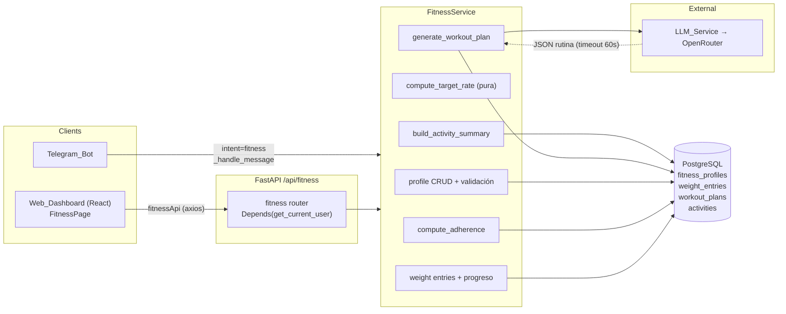
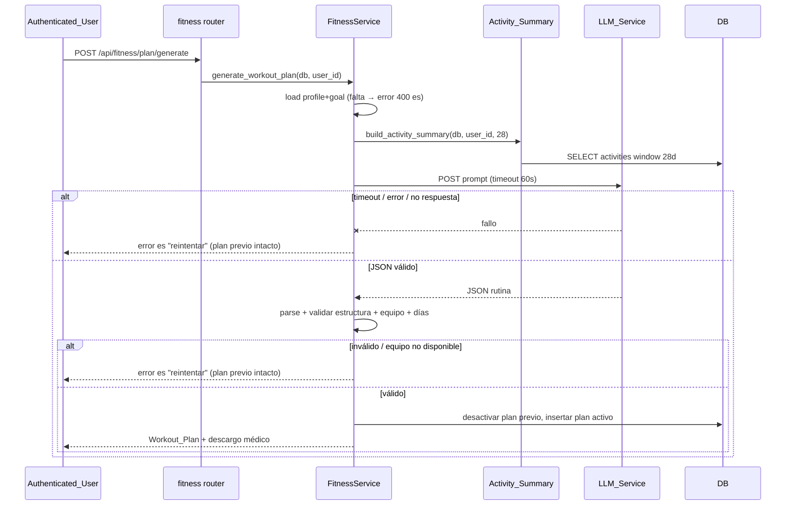
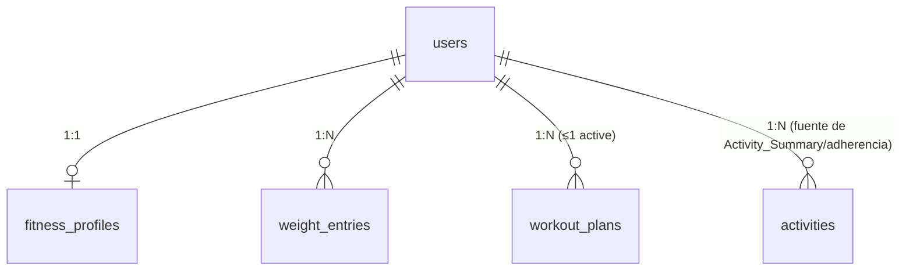

# Design Document: Fitness Coach

## Overview

El **Fitness Coach** añade a HabitTrack la capacidad de estructurar el entrenamiento del usuario. Sobre la arquitectura existente (FastAPI async + SQLAlchemy 2.0 + PostgreSQL + React + Telegram + OpenRouter), se introduce:

- Un **perfil fitness** 1:1 con el usuario (datos corporales, equipo, nivel, disponibilidad, objetivo), diseñado para ser reutilizado por la futura feature *meal-planner*.
- Un **objetivo** cuantitativo (`weight_target` con peso A→B y plazo) o cualitativo/de rendimiento.
- Un **cálculo de ritmo objetivo** (Target_Rate) puro y testeable, con advertencia de plazo poco saludable y descargo médico.
- Un **resumen de actividad** (Activity_Summary) sobre una ventana de 28 días construido desde la tabla `activities` existente.
- La **generación de rutina** (Workout_Plan) vía LLM_Service, validada contra el equipo disponible y la disponibilidad de días, con manejo robusto de fallos del LLM.
- **Registro de peso** (Weight_Entry) y visualización de **progreso** y **adherencia**.
- Interfaces **web** (nueva página `/fitness`) y **Telegram** (nuevo intent `fitness`).

El diseño reutiliza deliberadamente los patrones del proyecto: modelos SQLAlchemy 2.0 `Mapped`/`mapped_column`, routers finos bajo `/api/` con `Depends(get_db)` y `Depends(get_current_user)`, una capa de servicio para la lógica de negocio, listas serializadas como JSON en columnas `String` (igual que `Activity.sets_data`), migración vía `create_all` idempotente + `_migrate_columns` + una migración Alembic autogenerada, y llamadas al LLM con `httpx` y timeout.

### Design Decisions clave

| Decisión | Rationale | Requisitos |
| --- | --- | --- |
| `equipment` almacenado como JSON string en columna `String` | Consistencia con `Activity.sets_data`; el catálogo es pequeño y siempre se lee entero. Evita una tabla de unión innecesaria. | 1.2, 5.4 |
| `Target_Rate` como función pura (sin I/O) | Testeable con Hypothesis; reutilizable por Meal_Planner. | 3.1–3.4 |
| `Activity_Summary` construido desde `activities` existente | No duplica datos; una sola fuente de verdad de volumen. | 4.1–4.4 |
| A lo más un `WorkoutPlan` activo por usuario (flag `active`) | Igual patrón que `Goal.active`/`Challenge.active`. | 5.8 |
| Validación del plan **antes** de persistir | Estado previo se preserva ante fallo del LLM o equipo inválido. | 5.5, 6.4 |
| Gráfico de progreso con SVG propio | No hay librería de gráficos en `src/` (solo react, react-dom, react-router-dom, axios). Se evita añadir dependencias pesadas. | 9.6 |
| Nuevo intent `fitness` en `SYSTEM_PROMPT` + fallback por keywords | Igual patrón que reminders/goals (LLM + `_detect_*_keywords`). | 10.2–10.5 |

## Architecture



Flujo de generación de rutina (Req 5, 6):



## Components and Interfaces

### 1. Data Models (SQLAlchemy 2.0)

Nuevos archivos en `app/models/` (uno por entidad), registrados en `app/models/__init__.py` e importados en `init_db`.

#### `app/models/fitness_profile.py`

```python
"""Fitness profile model (1:1 with User). Reused by the future meal-planner."""
from datetime import datetime, date
from typing import TYPE_CHECKING

from sqlalchemy import ForeignKey, String, Integer, Float, func
from sqlalchemy.orm import Mapped, mapped_column, relationship

from app.database import Base

if TYPE_CHECKING:
    from app.models.user import User


class FitnessProfile(Base):
    """Body data, equipment, level, availability and current goal for a user."""
    __tablename__ = "fitness_profiles"

    id: Mapped[int] = mapped_column(primary_key=True)
    user_id: Mapped[int] = mapped_column(ForeignKey("users.id"), unique=True, index=True)

    # Body data
    weight_kg: Mapped[float] = mapped_column(Float)          # 30..300
    height_cm: Mapped[float] = mapped_column(Float)          # 100..250
    age: Mapped[int] = mapped_column(Integer)                # 13..100
    sex: Mapped[str | None] = mapped_column(String(10))      # male|female|other (optional)

    # Level & availability
    level: Mapped[str] = mapped_column(String(20))           # principiante|intermedio|avanzado
    equipment: Mapped[str] = mapped_column(String(300), default="[]")  # JSON list of Equipment_Item
    days_per_week: Mapped[int] = mapped_column(Integer)      # 1..7
    minutes_per_session: Mapped[int] = mapped_column(Integer)  # 10..240

    # Goal (kept on the profile; at most one active goal — Req 2.7)
    goal_type: Mapped[str | None] = mapped_column(String(20))  # Goal_Type
    target_weight_kg: Mapped[float | None] = mapped_column(Float)     # only for weight_target
    target_date: Mapped[str | None] = mapped_column(String(20))       # ISO date, only weight_target
    performance_target: Mapped[str | None] = mapped_column(String(200))  # only performance

    created_at: Mapped[datetime] = mapped_column(default=func.now())
    updated_at: Mapped[datetime] = mapped_column(default=func.now(), onupdate=func.now())

    user: Mapped["User"] = relationship(back_populates="fitness_profile")

    # ── Meal_Planner consumption helpers (Req 1.9, 3.6) ──────────────────────
    def equipment_list(self) -> list[str]:
        import json
        try:
            value = json.loads(self.equipment or "[]")
            return value if isinstance(value, list) else []
        except (ValueError, TypeError):
            return []

    def meal_planner_view(self) -> dict:
        """Expose weight/target/date/level for the Meal_Planner."""
        return {
            "current_weight_kg": self.weight_kg,
            "target_weight_kg": self.target_weight_kg,
            "target_date": self.target_date,
            "level": self.level,
            "goal_type": self.goal_type,
        }
```

#### `app/models/weight_entry.py`

```python
"""Weight_Entry: a body-weight measurement on a given date."""
from datetime import datetime
from typing import TYPE_CHECKING

from sqlalchemy import ForeignKey, Float, String, func
from sqlalchemy.orm import Mapped, mapped_column, relationship

from app.database import Base

if TYPE_CHECKING:
    from app.models.user import User


class WeightEntry(Base):
    __tablename__ = "weight_entries"

    id: Mapped[int] = mapped_column(primary_key=True)
    user_id: Mapped[int] = mapped_column(ForeignKey("users.id"), index=True)
    weight_kg: Mapped[float] = mapped_column(Float)      # 30..300
    entry_date: Mapped[str] = mapped_column(String(20), index=True)  # ISO date "YYYY-MM-DD"
    created_at: Mapped[datetime] = mapped_column(default=func.now())

    user: Mapped["User"] = relationship(back_populates="weight_entries")
```

#### `app/models/workout_plan.py`

```python
"""Workout_Plan: generated training routine. At most one active per user."""
from datetime import datetime
from typing import TYPE_CHECKING

from sqlalchemy import ForeignKey, String, Boolean, Text, func
from sqlalchemy.orm import Mapped, mapped_column, relationship

from app.database import Base

if TYPE_CHECKING:
    from app.models.user import User


class WorkoutPlan(Base):
    __tablename__ = "workout_plans"

    id: Mapped[int] = mapped_column(primary_key=True)
    user_id: Mapped[int] = mapped_column(ForeignKey("users.id"), index=True)
    goal_type: Mapped[str] = mapped_column(String(20))
    # JSON: [{"day": "Día 1", "exercises": [{"name","sets","reps","duration_seconds","rest_seconds","equipment"}]}]
    structure: Mapped[str] = mapped_column(Text)
    active: Mapped[bool] = mapped_column(Boolean, default=True, index=True)
    created_at: Mapped[datetime] = mapped_column(default=func.now())

    user: Mapped["User"] = relationship(back_populates="workout_plans")

    def structure_list(self) -> list[dict]:
        import json
        try:
            value = json.loads(self.structure or "[]")
            return value if isinstance(value, list) else []
        except (ValueError, TypeError):
            return []
```

#### `User` relationships (edición de `app/models/user.py`)

```python
# Added inside class User (imports guarded by TYPE_CHECKING)
fitness_profile: Mapped["FitnessProfile | None"] = relationship(
    back_populates="user", cascade="all, delete-orphan", uselist=False
)
weight_entries: Mapped[list["WeightEntry"]] = relationship(
    back_populates="user", cascade="all, delete-orphan"
)
workout_plans: Mapped[list["WorkoutPlan"]] = relationship(
    back_populates="user", cascade="all, delete-orphan"
)
```

### 2. FitnessService (`app/services/fitness_service.py`)

#### Constantes: catálogo de equipo y mapa ejercicio→equipo

```python
# Equipment_Item catalog (Req 1.2, 1.7)
EQUIPMENT_CATALOG: set[str] = {
    "mancuernas", "barra", "banco", "kettlebell", "bandas",
    "peso corporal", "acceso a gimnasio", "máquinas",
}

# Required equipment per exercise keyword (Req 5.3/5.4 validation).
# "peso corporal" is the fallback (no equipment required).
EXERCISE_EQUIPMENT: dict[str, str] = {
    "press banca": "banco",
    "sentadilla con barra": "barra",
    "peso muerto": "barra",
    "curl con mancuerna": "mancuernas",
    "swing": "kettlebell",
    "remo con banda": "bandas",
    "flexiones": "peso corporal",
    "dominadas": "peso corporal",
    "prensa": "máquinas",
    # ... extensible; unknown → treated as "peso corporal"
}

VALID_LEVELS = {"principiante", "intermedio", "avanzado"}
VALID_SEX = {"male", "female", "other"}
VALID_GOAL_TYPES = {
    "weight_target", "lose_weight", "gain_muscle",
    "maintain", "improve_endurance", "performance",
}
KCAL_PER_KG = 7700.0
ACTIVITY_WINDOW_DAYS = 28

MEDICAL_DISCLAIMER = (
    "Esta información es una estimación orientativa, no constituye consejo ni "
    "diagnóstico médico. Consulta a un profesional de la salud antes de iniciar "
    "un plan de entrenamiento o cambios en tu alimentación."
)
```

#### Firmas de funciones

```python
# ── Validation (Req 1, 2, 7) ─────────────────────────────────────────────────
def validate_profile_fields(
    weight_kg: float, height_cm: float, age: int, level: str,
    days_per_week: int, minutes_per_session: int,
    sex: str | None, equipment: list[str],
) -> None:
    """Raise ValidationError (mapped to 422/400) with a Spanish message identifying
    the invalid field and its valid range. Checks:
      weight 30..300, height 100..250, age 13..100, days 1..7, minutes 10..240,
      level in VALID_LEVELS, sex in VALID_SEX or None, equipment ⊆ EQUIPMENT_CATALOG."""

def validate_goal_fields(
    goal_type: str, target_weight_kg: float | None,
    target_date: str | None, performance_target: str | None,
) -> None:
    """Raise ValidationError with Spanish message. Checks:
      goal_type in VALID_GOAL_TYPES;
      if weight_target: target_weight in 30..300 AND target_date > today;
      if performance: performance_target length 1..200."""

# ── Target rate (Req 3) — PURE, no I/O ───────────────────────────────────────
def compute_target_rate(
    current_weight: float, target_weight: float, weeks: float,
) -> dict:
    """Return {
        'rate_kg_per_week': round((target-current)/weeks, 2),
        'daily_kcal_delta': round(abs(rate) * 7700 / 7),
        'direction': 'déficit' if rate < 0 else 'superávit' if rate > 0 else 'mantenimiento',
        'warning': bool,          # True if |rate| > 1.0 kg/wk OR |rate| > 1% of current/wk
        'warning_message': str | None,  # Spanish, suggests widening the timeframe
        'disclaimer': MEDICAL_DISCLAIMER,
      }
    Raise ValidationError if weeks < 1, weeks == 0, or weights missing (Req 3.4)."""

# ── Activity summary (Req 4) ─────────────────────────────────────────────────
async def build_activity_summary(
    db: AsyncSession, user_id: int, window_days: int = ACTIVITY_WINDOW_DAYS,
) -> dict:
    """Return {'frequency': int, 'total_minutes': int, 'types': list[str]} over the
    last `window_days` days. Missing duration counts toward frequency/types but 0 min.
    No activities → {'frequency':0,'total_minutes':0,'types':[]} (Req 4.3, 4.4)."""

# ── Plan generation & validation (Req 5, 6) ──────────────────────────────────
def validate_plan_structure(structure: list[dict]) -> None:
    """Raise ValidationError if not 1..7 days, or any day not 1..20 exercises, or any
    exercise field out of range (name 1..100, sets 1..20, reps 1..100, duration
    1..7200 s, rest 0..3600 s). Enforces sets/reps XOR duration (Req 5.2, 5.3)."""

def required_equipment(exercise_name: str) -> str:
    """Return the equipment keyword required for an exercise (default 'peso corporal')."""

def validate_plan_equipment(structure: list[dict], available: list[str]) -> None:
    """Raise EquipmentError (Spanish, offers retry) if any exercise requires equipment
    not in `available` (Req 5.4, 5.5)."""

def clamp_days_to_availability(structure: list[dict], days_per_week: int) -> list[dict]:
    """Trim the plan to at most `days_per_week` days (Req 5.6)."""

async def generate_workout_plan(
    db: AsyncSession, user_id: int,
    overrides: dict | None = None,   # {goal_type?, equipment?, days_per_week?} from Telegram (Req 10.4)
) -> WorkoutPlan:
    """Load profile+goal (missing → GoalRequiredError, Spanish, Req 5.7).
    Build Activity_Summary, call LLM_Service.generate_workout_plan (timeout 60s),
    parse JSON, validate_plan_structure, clamp_days_to_availability,
    validate_plan_equipment. On any LLM failure/timeout/unparseable/invalid equipment:
    raise the corresponding Spanish error WITHOUT touching the previous active plan
    (Req 6.1–6.4). On success: mark previous active plan inactive, persist new active
    plan (Req 5.8) and return it."""

async def get_active_plan(db: AsyncSession, user_id: int) -> WorkoutPlan | None:
    """Return the active Workout_Plan or None (Req 5.9, 5.10)."""

# ── Weight (Req 7) ───────────────────────────────────────────────────────────
async def add_weight_entry(
    db: AsyncSession, user_id: int, weight_kg: float, entry_date: str,
) -> WeightEntry:
    """Validate 30..300 (else ValidationError, Req 7.2). Create entry. If it is the
    latest entry_date for the user, update FitnessProfile.weight_kg (Req 7.3)."""

async def list_weight_entries(db: AsyncSession, user_id: int) -> list[WeightEntry]:
    """Return entries ordered ascending by entry_date; empty list if none (Req 7.4, 7.5)."""

# ── Adherence (Req 8) ────────────────────────────────────────────────────────
async def compute_adherence(db: AsyncSession, user_id: int) -> dict:
    """If no active plan OR planned sessions == 0 within the period → 
    {'available': False, 'message': '<es: no hay adherencia calculable>'} (Req 8.5, no ÷0).
    Else → {'available': True, 'completed': int, 'planned': int,
            'ratio': round(completed/planned, 2)} using Activity records within the
    active plan period (Req 8.3, 8.4)."""

async def get_progress(db: AsyncSession, user_id: int) -> dict:
    """Return {'series': [{'date','weight_kg'}...],
               'target_weight_kg': float | None}  # present only if goal_type == weight_target
    (Req 8.1, 8.2)."""
```

`ValidationError`, `EquipmentError`, `GoalRequiredError`, `LLMError` son excepciones internas del servicio; el router las traduce a `HTTPException` con el mensaje en español (ver Error Handling).

### 3. LLM_Service extension (`app/services/llm_service.py`)

Se añade una función dedicada con su propio system prompt (no se toca el `SYSTEM_PROMPT` de interpretación de actividades salvo por el intent `fitness`, ver Telegram).

```python
WORKOUT_SYSTEM_PROMPT = """Eres un entrenador personal. Genera una rutina de entrenamiento en JSON.
Devuelve SOLO JSON con esta estructura, sin texto adicional:
{
  "days": [
    {
      "day": "Día 1 - Empuje",
      "exercises": [
        {"name": "Press banca", "sets": 4, "reps": 10,
         "duration_seconds": null, "rest_seconds": 90, "equipment": "banco"}
      ]
    }
  ]
}
Reglas:
- Entre 1 y {days_per_week} días; cada día 1 a 20 ejercicios.
- Usa ÚNICAMENTE equipo de esta lista disponible: {equipment}.
- Cada ejercicio define sets(1-20)+reps(1-100) O duration_seconds(1-7200), y rest_seconds(0-3600).
- Ajusta volumen e intensidad al nivel ({level}) y al objetivo ({goal}).
- Considera la actividad reciente del usuario: {activity_summary}.
- Nombres de ejercicio en español, 1 a 100 caracteres."""

async def generate_workout_plan(
    profile: dict, goal: dict, activity_summary: dict,
    timeout_seconds: float = 60.0,
) -> dict | None:
    """Build the prompt from profile+goal+activity_summary, call OpenRouter with a
    60s timeout, strip code fences (same helper as _call_llm), json.loads the result.
    Return the parsed dict or None on timeout/HTTP error/empty/JSONDecodeError."""
```

Reutiliza el patrón de `_call_llm`: `httpx.AsyncClient(timeout=timeout_seconds)`, encabezados con `settings.openrouter_api_key`, `settings.openrouter_model`, y el stripping de ```` ``` ```` fences. `max_tokens` mayor (p. ej. 1200) por el tamaño de la rutina.

### 4. Endpoints (`app/routes/fitness.py`, prefix `/api/fitness`)

Todos con `current_user: User = Depends(get_current_user)` (Req 11.1, 11.2). Los datos se filtran siempre por `current_user.id`, salvo admin (Req 11.3, 11.4). Registrado en `main.py` como `from app.routes import fitness` y `app.include_router(fitness.router, prefix="/api/fitness", tags=["Fitness"])` (sin colisión de nombres con `settings_routes`).

| Método | Ruta | Request (Pydantic) | Response | Requisitos |
| --- | --- | --- | --- | --- |
| GET | `/profile` | — | `FitnessProfileOut` o 404 con mensaje es | 1.8, 1.9 |
| PUT | `/profile` | `ProfileIn{weight_kg,height_cm,age,sex?,level,equipment[],days_per_week,minutes_per_session}` | `FitnessProfileOut` | 1.1–1.7 |
| PUT | `/goal` | `GoalIn{goal_type,target_weight_kg?,target_date?,performance_target?}` | `GoalOut{goal_type,...,target_rate?}` (con descargo) | 2.1–2.7, 3.1–3.6 |
| POST | `/weight` | `WeightIn{weight_kg,entry_date}` | `WeightEntryOut` | 7.1–7.3 |
| GET | `/weight` | — | `list[WeightEntryOut]` (asc por fecha) | 7.4, 7.5 |
| POST | `/plan/generate` | `PlanGenerateIn{}` (usa perfil+objetivo) | `WorkoutPlanOut` (con descargo) | 5.1–5.8 |
| GET | `/plan` | — | `WorkoutPlanOut` o `{message: "no hay rutina activa..."}` | 5.9, 5.10 |
| GET | `/progress` | — | `ProgressOut{series[],target_weight_kg?}` | 8.1, 8.2 |
| GET | `/adherence` | — | `AdherenceOut{available,completed?,planned?,ratio?,message?}` | 8.3–8.5 |

Ejemplos request/response:

`PUT /api/fitness/goal` (weight_target):
```json
// request
{ "goal_type": "weight_target", "target_weight_kg": 75.0, "target_date": "2026-06-01" }
// response 200
{
  "goal_type": "weight_target",
  "target_weight_kg": 75.0,
  "target_date": "2026-06-01",
  "target_rate": {
    "rate_kg_per_week": -0.62,
    "daily_kcal_delta": 682,
    "direction": "déficit",
    "warning": false,
    "warning_message": null,
    "disclaimer": "Esta información es una estimación orientativa..."
  }
}
```

`POST /api/fitness/plan/generate` (equipo inválido → 400 es):
```json
{ "detail": "La rutina generada usa equipo que no tienes disponible. Intenta generarla de nuevo." }
```

`GET /api/fitness/adherence` (sin plan):
```json
{ "available": false, "message": "No hay una rutina activa; no se puede calcular adherencia todavía." }
```

### 5. Telegram (`intent = "fitness"`)

**`llm_service.SYSTEM_PROMPT`**: se añade una rama de intención:

```
## Si intent="fitness" (el usuario pide o consulta su rutina):
{
  "intent": "fitness",
  "data": {
    "action": "generate" | "view",
    "goal_type": "string o null",
    "equipment": ["..."] o null,
    "days_per_week": number o null
  }
}
Ejemplos:
- "genérame una rutina para ganar músculo 4 días" → generate, goal_type="gain_muscle", days_per_week=4
- "mi rutina" / "ver mi rutina" → view
```

Además, un fallback por keywords `_detect_fitness_keywords(text)` (mismo patrón que `_detect_goal_keywords`) detecta "rutina", "entrenamiento", "plan de gym" para robustez si el LLM falla.

**`telegram_bot._handle_message`** (y su gemelo en `routes/telegram.py`): nueva rama `elif intent == "fitness": await _handle_fitness(chat_id, user, response, db)`.

`_handle_fitness`:
- Chat no vinculado → ya se maneja arriba: `_handle_message` solo se invoca para usuarios vinculados; el path de webhook/polling responde en español pidiendo vincular cuando `user is None` (Req 10.1).
- `action == "generate"`: construye `overrides` desde `data` (goal_type/equipment/days_per_week si vienen, si no usa el perfil — Req 10.4, 10.5), llama `fitness_service.generate_workout_plan`, responde en español con la rutina formateada + descargo. Errores (perfil incompleto, fallo LLM, equipo inválido) → mensaje en español con opción de reintentar.
- `action == "view"`: `get_active_plan`; si existe formatea días/ejercicios en español, si no responde "no tienes una rutina activa; puedo generarte una".

### 6. Frontend

**`src/lib/api.ts`** — añadir `fitnessApi` + interfaces:

```typescript
export interface FitnessProfile {
  weight_kg: number; height_cm: number; age: number; sex: string | null
  level: string; equipment: string[]; days_per_week: number; minutes_per_session: number
  goal_type: string | null; target_weight_kg: number | null; target_date: string | null
  performance_target: string | null
}
export interface TargetRate {
  rate_kg_per_week: number; daily_kcal_delta: number; direction: string
  warning: boolean; warning_message: string | null; disclaimer: string
}
export interface WorkoutExercise {
  name: string; sets: number | null; reps: number | null
  duration_seconds: number | null; rest_seconds: number; equipment: string
}
export interface WorkoutDay { day: string; exercises: WorkoutExercise[] }
export interface WorkoutPlan { id: number; goal_type: string; structure: WorkoutDay[]; disclaimer: string }
export interface WeightEntry { id: number; weight_kg: number; entry_date: string }
export interface Progress { series: { date: string; weight_kg: number }[]; target_weight_kg: number | null }
export interface Adherence { available: boolean; completed?: number; planned?: number; ratio?: number; message?: string }

export const fitnessApi = {
  getProfile: () => api.get<FitnessProfile>('/fitness/profile'),
  putProfile: (d: Partial<FitnessProfile>) => api.put<FitnessProfile>('/fitness/profile', d),
  putGoal: (d: object) => api.put('/fitness/goal', d),
  postWeight: (d: { weight_kg: number; entry_date: string }) => api.post<WeightEntry>('/fitness/weight', d),
  getWeight: () => api.get<WeightEntry[]>('/fitness/weight'),
  generatePlan: () => api.post<WorkoutPlan>('/fitness/plan/generate'),
  getPlan: () => api.get<WorkoutPlan | { message: string }>('/fitness/plan'),
  getProgress: () => api.get<Progress>('/fitness/progress'),
  getAdherence: () => api.get<Adherence>('/fitness/adherence'),
}
```

**`src/pages/FitnessPage.tsx`** — página en español, Tailwind dark (usa los tokens del tema: `card`, `text-primary`, `text-secondary`, `text-dim`, `accent`, `bg-surface`, `bg-elevated`, `bg-border`, `btn-ghost`), con secciones:
1. **Perfil**: formulario (peso, altura, edad, sexo, nivel, equipo con checkboxes del catálogo, días/semana, minutos/sesión). Muestra errores en español devueltos por la API y conserva lo ingresado (Req 9.1–9.3).
2. **Objetivo**: selector de `goal_type`; si `weight_target` muestra peso objetivo + fecha y renderiza `target_rate` con `warning_message` y `disclaimer` visibles (Req 9.1, 3.3, 3.5).
3. **Rutina**: botón "Generar rutina" y render del plan activo (días → ejercicios) en español, con estados loading/error y descargo (Req 9.4, 9.5).
4. **Peso + progreso**: formulario de registro de peso y **gráfico SVG propio** (`WeightChart`) de la serie, con línea de objetivo si existe (Req 9.6, 9.7).
5. **Adherencia**: muestra `completed/planned` y ratio, o el mensaje cuando no es calculable.

**`src/components/WeightChart.tsx`** — componente SVG puro (sin librería): recibe `series` y `targetWeight?`, calcula min/max y dibuja `<polyline>` + puntos + una línea horizontal punteada para el objetivo. Rationale: no hay librería de gráficos en `src/`; un SVG responsivo evita añadir dependencias.

**`src/main.tsx`**: nueva ruta protegida `<Route path="/fitness" element={<FitnessPage />} />` dentro de `AppLayout`.

**`src/components/Navbar.tsx`**: nuevo enlace `{ to: '/fitness', icon: '🏋️', label: 'Fitness' }`.

## Data Models

### Tablas nuevas

`fitness_profiles`
| Columna | Tipo | Notas |
| --- | --- | --- |
| id | PK int | |
| user_id | FK users.id, **unique**, index | relación 1:1 (Req 1.1) |
| weight_kg | float | 30..300 |
| height_cm | float | 100..250 |
| age | int | 13..100 |
| sex | varchar(10) nullable | male/female/other (Req 1.4) |
| level | varchar(20) | principiante/intermedio/avanzado |
| equipment | varchar(300) default `'[]'` | JSON list (Req 1.2) |
| days_per_week | int | 1..7 |
| minutes_per_session | int | 10..240 |
| goal_type | varchar(20) nullable | Goal_Type (Req 2) |
| target_weight_kg | float nullable | weight_target |
| target_date | varchar(20) nullable | ISO date |
| performance_target | varchar(200) nullable | performance |
| created_at / updated_at | datetime | |

`weight_entries`
| Columna | Tipo | Notas |
| --- | --- | --- |
| id | PK int | |
| user_id | FK users.id, index | |
| weight_kg | float | 30..300 |
| entry_date | varchar(20), index | ISO date (Req 7) |
| created_at | datetime | |

`workout_plans`
| Columna | Tipo | Notas |
| --- | --- | --- |
| id | PK int | |
| user_id | FK users.id, index | |
| goal_type | varchar(20) | |
| structure | text | JSON días/ejercicios (Req 5.2, 5.3) |
| active | bool, index, default true | a lo más 1 activo (Req 5.8) |
| created_at | datetime | |

### Relaciones



### Migración

Consistente con el proyecto (dos redes de seguridad):
1. **`create_all` idempotente**: importar los tres modelos nuevos en `init_db` (`from app.models import ... fitness_profile, weight_entry, workout_plan`) y registrarlos en `app/models/__init__.py`. `Base.metadata.create_all` crea las tablas si no existen.
2. **Migración Alembic autogenerada**: `alembic revision --autogenerate -m "add fitness coach tables"` genera el `create_table` para las tres tablas y el índice único en `fitness_profiles.user_id`. `_migrate_columns` no se necesita para tablas nuevas (solo añade columnas a tablas existentes); se documenta que las columnas nuevas de `users` no aplican aquí porque las relaciones no añaden columnas a `users`.

Documentación: en entornos con la BD ya creada, `create_all` cubre la creación; Alembic es la fuente de verdad versionada para despliegues limpios (Fly.io/Railway).

## Correctness Properties

*A property is a characteristic or behavior that should hold true across all valid executions of a system-essentially, a formal statement about what the system should do. Properties serve as the bridge between human-readable specifications and machine-verifiable correctness guarantees.*

Estas propiedades aplican a la lógica pura y a los invariantes de estado del Fitness_Coach (validación, cálculo de ritmo, agregación de actividad, validación de plan, adherencia, ordenamiento, privacidad). Las capas de I/O (LLM, HTTP, render UI) se cubren con tests de ejemplo/integración (ver Testing Strategy).

### Property 1: Perfil válido es aceptado

*For any* combinación de peso en 30–300 kg, altura en 100–250 cm, edad en 13–100 años, nivel en {principiante, intermedio, avanzado}, sexo en {male, female, other} o ausente, equipo que sea subconjunto del catálogo, días por semana en 1–7 y minutos por sesión en 10–240, la validación del perfil debe aceptar la entrada sin error y el perfil almacenado debe reflejar exactamente esos valores.

**Validates: Requirements 1.1, 1.2, 1.3, 1.4**

### Property 2: Perfil inválido es rechazado y el estado previo se preserva

*For any* combinación de campos de perfil en la que al menos un valor esté fuera de su rango válido (peso, altura, edad, días, minutos), o el nivel no pertenezca al conjunto válido, o algún equipo no pertenezca al catálogo, la validación debe rechazar la operación con un mensaje en español que identifique el campo inválido, y el Fitness_Profile previo debe permanecer sin cambios.

**Validates: Requirements 1.5, 1.6, 1.7**

### Property 3: Vista de perfil para Meal_Planner

*For any* Fitness_Profile, la vista para el Meal_Planner debe contener las claves peso actual, peso objetivo, fecha objetivo, nivel y tipo de objetivo, con valores idénticos a los del perfil.

**Validates: Requirements 1.9**

### Property 4: Objetivo válido es aceptado

*For any* objetivo cuyo Goal_Type pertenezca al conjunto válido, donde para `weight_target` el peso objetivo esté en 30–300 kg y la fecha objetivo sea posterior a hoy, y para `performance` la descripción tenga longitud 1–200, la validación del objetivo debe aceptar la entrada y el objetivo almacenado debe reflejar esos valores.

**Validates: Requirements 2.1, 2.2, 2.3**

### Property 5: Objetivo inválido es rechazado y el objetivo previo se preserva

*For any* objetivo cuyo Goal_Type no pertenezca al conjunto válido, o sea `performance` sin descripción, o sea `weight_target` con fecha objetivo anterior o igual a hoy, o con peso objetivo fuera de 30–300 kg, la validación debe rechazar la operación con un mensaje en español que identifique el campo inválido, y el Fitness_Goal previo debe permanecer sin cambios.

**Validates: Requirements 2.4, 2.5, 2.6**

### Property 6: A lo más un objetivo activo por usuario

*For any* secuencia de actualizaciones de objetivo válidas, tras aplicarlas el Fitness_Profile debe contener exactamente el último objetivo enviado y ningún objetivo anterior.

**Validates: Requirements 2.7**

### Property 7: Cálculo correcto del Target_Rate y forma de salida

*For any* peso actual y peso objetivo en rango y plazo en semanas mayor o igual a 1, el Target_Rate debe ser igual a (peso objetivo menos peso actual) dividido entre las semanas redondeado a dos decimales; el ajuste calórico diario debe ser igual al valor absoluto del Target_Rate por 7700 dividido entre 7; la dirección debe ser déficit si el Target_Rate es negativo y superávit si es positivo; y el resultado debe incluir siempre un descargo en español no vacío.

**Validates: Requirements 3.1, 3.2, 3.5, 3.6**

### Property 8: Umbral de advertencia de ritmo saludable

*For any* peso actual y Target_Rate calculado, la advertencia debe estar activa si y solo si el valor absoluto del Target_Rate excede 1,00 kg por semana o excede el 1,0 % del peso actual por semana, y el Target_Rate calculado debe permanecer sin modificarse cuando la advertencia se active.

**Validates: Requirements 3.3**

### Property 9: Entradas inválidas del cálculo de ritmo señalan error

*For any* plazo menor que 1 semana o igual a cero, o ausencia del peso actual o del peso objetivo, el cálculo del Target_Rate debe señalar un error en español y no producir un Target_Rate.

**Validates: Requirements 3.4**

### Property 10: Agregación y ventana del Activity_Summary

*For any* conjunto de registros de Activity con fechas dentro y fuera del Activity_Window de 28 días, el Activity_Summary debe considerar únicamente los registros dentro de la ventana, con frecuencia igual al número de esos registros, minutos totales igual a la suma de sus duraciones (tratando la duración ausente como 0) y tipos igual a la lista de tipos distintos presentes en la ventana; cuando no hay registros en la ventana, la frecuencia y los minutos deben ser 0 y la lista de tipos vacía.

**Validates: Requirements 4.1, 4.2, 4.3, 4.4**

### Property 11: Validación de la estructura del plan

*For any* estructura de rutina, la validación debe aceptarla si y solo si contiene entre 1 y 7 días, cada día contiene entre 1 y 20 ejercicios, y cada ejercicio tiene nombre de 1 a 100 caracteres, un esquema de series de 1 a 20 con repeticiones de 1 a 100 o bien una duración de 1 a 7200 segundos, y un descanso de 0 a 3600 segundos.

**Validates: Requirements 5.2, 5.3**

### Property 12: Validación del equipo del plan

*For any* rutina y conjunto de equipo disponible, la validación de equipo debe aceptar la rutina si y solo si el equipo requerido por cada ejercicio está incluido en el equipo disponible; en caso contrario debe señalar un error en español que ofrezca reintentar y la rutina no debe persistirse.

**Validates: Requirements 5.4, 5.5**

### Property 13: Ajuste de días a la disponibilidad

*For any* estructura de rutina y número de días por semana disponibles, el número de días de la rutina ajustada no debe exceder el mínimo entre el número de días original y los días por semana disponibles.

**Validates: Requirements 5.6**

### Property 14: A lo más un Workout_Plan activo por usuario

*For any* secuencia de generaciones de rutina exitosas para un usuario, tras cada generación debe existir exactamente un Workout_Plan activo y todos los planes anteriores del usuario deben quedar inactivos.

**Validates: Requirements 5.8**

### Property 15: Preservación del estado ante fallo de generación

*For any* fallo durante la generación de rutina (tiempo de espera del LLM_Service, error o ausencia de respuesta, contenido no interpretable, o equipo no disponible), el Fitness_Profile, el Fitness_Goal y el Workout_Plan activo previo del usuario deben permanecer sin cambios.

**Validates: Requirements 5.5, 6.1, 6.2, 6.3, 6.4**

### Property 16: Validación del rango de peso registrado

*For any* peso enviado como Weight_Entry, la operación debe crear el registro si y solo si el peso está en el rango 30–300 kg; fuera de ese rango debe rechazarse con un mensaje en español que indique el rango válido y no debe crearse ningún Weight_Entry.

**Validates: Requirements 7.1, 7.2**

### Property 17: El peso más reciente actualiza el perfil

*For any* conjunto de Weight_Entry de un usuario, el peso actual del Fitness_Profile debe ser igual al peso del Weight_Entry cuya fecha sea la más reciente.

**Validates: Requirements 7.3**

### Property 18: Ordenamiento cronológico ascendente del historial y del progreso

*For any* conjunto de Weight_Entry de un usuario, tanto el historial de peso como la serie de progreso deben devolverse ordenados de forma ascendente por fecha; cuando no existan entradas, ambos deben devolverse vacíos.

**Validates: Requirements 7.4, 7.5, 8.1**

### Property 19: Peso objetivo incluido en el progreso solo para weight_target

*For any* Fitness_Profile, la respuesta de progreso debe incluir el peso objetivo si y solo si el Goal_Type del objetivo es `weight_target`.

**Validates: Requirements 8.2**

### Property 20: Relación de adherencia correcta

*For any* Workout_Plan activo con sesiones planificadas mayores que cero y cualquier conjunto de Activity, las sesiones realizadas deben contar únicamente las Activity dentro del periodo del plan y la adherencia debe ser igual a las sesiones realizadas divididas entre las sesiones planificadas, redondeada a dos decimales.

**Validates: Requirements 8.3, 8.4**

### Property 21: Adherencia sin división por cero

*For any* consulta de adherencia en la que no exista Workout_Plan activo o las sesiones planificadas sean cero, el sistema debe devolver un resultado no calculable con un mensaje en español y no debe producirse ninguna división por cero.

**Validates: Requirements 8.5**

### Property 22: Privacidad — solo registros propios

*For any* par de usuarios distintos no administradores, cada consulta de perfil, peso, objetivo o rutina debe devolver únicamente los registros pertenecientes al usuario solicitante, y toda solicitud de un usuario no administrador sobre datos de otro usuario debe rechazarse sin exponer esos datos.

**Validates: Requirements 11.3, 11.4**

### Property 23: Descargo médico en respuestas de rutina y objetivo de peso

*For any* respuesta que contenga un Workout_Plan o un objetivo de peso, la respuesta debe incluir un descargo en español no vacío que indique que la información es orientativa y no constituye consejo ni diagnóstico médico.

**Validates: Requirements 11.5**

## Error Handling

Excepciones internas del servicio traducidas por el router a `HTTPException` con `detail` en español:

| Situación | Excepción interna | HTTP | Mensaje (es) | Requisitos |
| --- | --- | --- | --- | --- |
| Campo de perfil/objetivo/peso fuera de rango o formato inválido | `ValidationError` | 422 (validación Pydantic) / 400 (regla de negocio) | Identifica el campo y su rango válido | 1.5–1.7, 2.4–2.6, 7.2 |
| Solicitud sin JWT válido | (dependencia `get_current_user`) | 401 | "No autenticado" | 11.1, 11.2 |
| No admin accede a datos de otro usuario | `HTTPException` | 403 / 404 | Sin exponer datos ajenos | 11.3, 11.4 |
| Generar rutina sin perfil/objetivo | `GoalRequiredError` | 400 | "Primero completa tu perfil y objetivo para generar una rutina." | 5.7 |
| LLM_Service timeout (>60s) | `LLMError(kind="timeout")` | 502/503 | "No pudimos generar tu rutina a tiempo. Intenta de nuevo." | 6.1 |
| LLM_Service error / sin respuesta | `LLMError(kind="error")` | 502 | "Ocurrió un problema al generar tu rutina. Intenta de nuevo." | 6.2 |
| LLM_Service contenido no interpretable | `LLMError(kind="parse")` | 502 | "No pudimos interpretar la rutina generada. Intenta de nuevo." | 6.3 |
| Rutina con equipo no disponible | `EquipmentError` | 400 | "La rutina generada usa equipo que no tienes disponible. Intenta generarla de nuevo." | 5.5 |
| Adherencia no calculable | (no error) | 200 | `{available:false, message:"No hay una rutina activa; no se puede calcular adherencia todavía."}` | 8.5 |

Principios:
- **Validar antes de mutar**: toda función que cambia estado valida por completo antes de persistir; ante cualquier fallo del LLM o validación, el plan activo previo, el perfil y el objetivo quedan intactos (Req 5.5, 6.4).
- **Descargos**: las respuestas de `/goal` (weight_target) y de rutina (`/plan/generate`, `/plan`) incluyen `disclaimer` en español (Req 3.5, 11.5).
- **Frontend**: `FitnessPage` muestra el `detail` en español devuelto por la API y conserva los datos ingresados (Req 9.3).
- **Telegram**: los handlers responden en español y ofrecen reintentar; chat no vinculado recibe la solicitud de vincular (Req 10.1).

## Testing Strategy

Marco existente del proyecto: **pytest** con **pytest-asyncio** (modo auto), **pytest-cov** e **Hypothesis** (ya presente, carpeta `.hypothesis/`). Los tests van en `tests/`.

### Enfoque dual

- **Property tests (Hypothesis)**: validan las propiedades universales sobre la lógica pura y los invariantes de estado. PBT es apropiado aquí porque `compute_target_rate`, `validate_profile_fields`, `validate_goal_fields`, `build_activity_summary`, `validate_plan_structure`, `validate_plan_equipment`, `clamp_days_to_availability`, `compute_adherence`, `list_weight_entries`/`get_progress` (ordenamiento) y la lógica de privacidad tienen entrada/salida clara y un espacio de entrada amplio (números, fechas, colecciones, estructuras).
- **Unit/example tests**: casos concretos, lecturas CRUD y verificación de wiring (endpoints, auth).
- **Integration tests (con mock del LLM)**: la generación de rutina que depende de OpenRouter se prueba con el LLM_Service mockeado (respuesta válida, timeout, error, JSON malformado). No se hace PBT sobre la llamada al LLM en sí (servicio externo, alto costo), pero la validación de la estructura devuelta sí es PBT.
- **Component tests (frontend)**: `FitnessPage` (envío de formularios, mostrar errores en español, estados loading) y `WeightChart` (render de la serie SVG). UI no usa PBT (render/interacción).

### Configuración de property tests

- Librería: **Hypothesis** (no implementar PBT desde cero).
- Mínimo **100 iteraciones** por property test (`@settings(max_examples=100)`).
- Cada property test se etiqueta con un comentario referenciando la propiedad del diseño:
  `# Feature: fitness-coach, Property N: <texto de la propiedad>`.
- Cada propiedad de la sección Correctness Properties se implementa con **un único** property test.

### Mapa propiedad → función bajo prueba

| Propiedad | Función / capa | Tipo |
| --- | --- | --- |
| 1, 2 | `validate_profile_fields` | Hypothesis |
| 3 | `FitnessProfile.meal_planner_view` | Hypothesis |
| 4, 5 | `validate_goal_fields` | Hypothesis |
| 6 | `put_goal` (invariante ≤1 objetivo) | Hypothesis + DB |
| 7, 8, 9 | `compute_target_rate` (pura) | Hypothesis |
| 10 | `build_activity_summary` | Hypothesis + DB |
| 11 | `validate_plan_structure` (pura) | Hypothesis |
| 12 | `validate_plan_equipment` (pura) | Hypothesis |
| 13 | `clamp_days_to_availability` (pura) | Hypothesis |
| 14 | `generate_workout_plan` (mock LLM) | Hypothesis + mock |
| 15 | `generate_workout_plan` fallos (mock LLM) | Hypothesis + mock |
| 16 | `add_weight_entry` | Hypothesis + DB |
| 17 | `add_weight_entry` (perfil = más reciente) | Hypothesis + DB |
| 18 | `list_weight_entries` / `get_progress` | Hypothesis + DB |
| 19 | `get_progress` | Hypothesis + DB |
| 20 | `compute_adherence` | Hypothesis + mock |
| 21 | `compute_adherence` (sin ÷0) | Hypothesis |
| 22 | endpoints `/api/fitness/*` privacidad | Hypothesis + DB |
| 23 | respuestas de `/plan` y `/goal` | Hypothesis |

### Tests de ejemplo / integración

- **Endpoints y auth**: cada endpoint sin token → 401; token válido → 200 (Req 11.1, 11.2).
- **Lecturas CRUD**: GET `/profile` devuelve todos los campos (Req 1.8); GET `/plan` sin plan → mensaje es (Req 5.10); con plan → estructura (Req 5.9).
- **Sexo** male/female/other/None aceptados; inválido rechazado (Req 1.4).
- **Generación** con mock LLM válido → plan persistido y activo (Req 5.1); mocks de timeout/None/JSON inválido → error es + estado preservado (Req 6.1–6.3, 6.5).
- **Telegram**: chat no vinculado → pedir vincular (Req 10.1); vinculado + mock LLM → genera y responde es (Req 10.2); ver rutina (Req 10.3); overrides del mensaje usados vs. valores del perfil (Req 10.4, 10.5).
- **Frontend (component tests)**: envío de perfil/objetivo/peso, visualización de errores en español, `WeightChart` render (Req 9.1–9.7).

### Balance

Los property tests cubren la corrección universal (validaciones, cálculo, agregación, invariantes, privacidad); los tests de ejemplo/integración cubren wiring, lecturas simples y las dependencias externas (LLM, UI). Se evita multiplicar unit tests donde una propiedad ya cubre el espacio de entrada.
