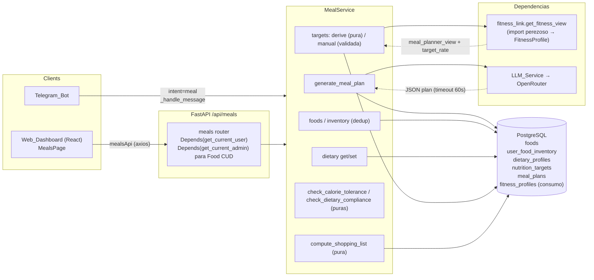
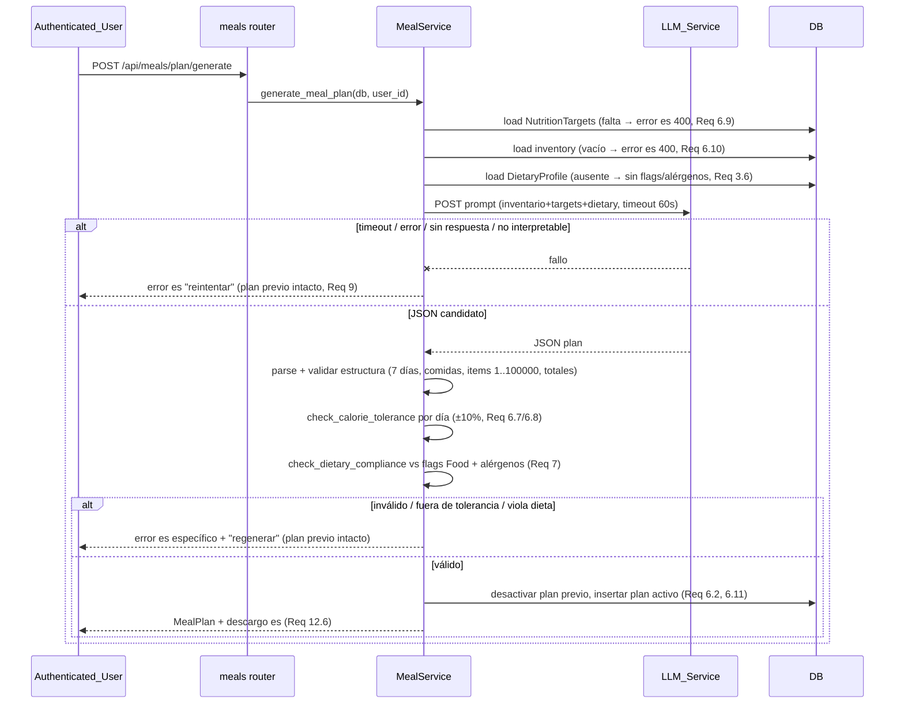
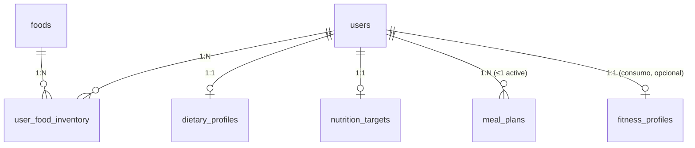

# Design Document: Meal Planner

## Overview

El **Meal Planner** (bot chef) añade a HabitTrack la capacidad de planificar las comidas de la semana usando principalmente el inventario del usuario y ajustándose a sus metas nutricionales. Sobre la arquitectura existente (FastAPI async + SQLAlchemy 2.0 + PostgreSQL + React + Telegram + OpenRouter) se introduce:

- Un **catálogo global de alimentos** (`Food`) sembrado con un conjunto base e incrementable por el administrador; cualquier usuario lo consulta (Req 1, 12.5).
- El **inventario/despensa** del usuario (`UserFoodInventory`), con deduplicación por `(user_id, food_id)` (Req 2).
- El **perfil dietético** 1:1 (`DietaryProfile`): banderas de dieta y alérgenos (Req 3).
- Las **metas nutricionales** 1:1 (`NutritionTargets`), derivadas del perfil fitness o ingresadas manualmente (Req 4, 5).
- La **generación del plan semanal** (`MealPlan`) vía LLM_Service, validada por estructura, tolerancia calórica (±10 %) y restricciones dietéticas, con manejo robusto de fallos del LLM y a lo más un plan activo por usuario (Req 6, 7, 9).
- La **lista de compras** opcional derivada del plan y el inventario (Req 13).
- Interfaces **web** (nueva página `/meals`) y **Telegram** (nuevo intent `meal`).

El diseño reutiliza deliberadamente los patrones del proyecto: modelos SQLAlchemy 2.0 `Mapped`/`mapped_column`, routers finos bajo `/api/` con `Depends(get_db)`, `Depends(get_current_user)` y `Depends(get_current_admin)`, una capa de servicio para la lógica de negocio, listas/estructuras serializadas como JSON en columnas `String`/`Text` (igual que `Activity.sets_data` y `WorkoutPlan.structure`), migración vía `create_all` idempotente + `_migrate_columns` + una migración Alembic autogenerada, seed idempotente (patrón `scripts/seed_calorie_formulas.py`), y llamadas al LLM con `httpx` y timeout (patrón `WORKOUT_SYSTEM_PROMPT`/`generate_workout_plan`).

### Integración con Fitness_Coach (dependencia explícita)

El Meal_Planner **consume** el modelo `FitnessProfile` que define la feature *fitness-coach*. En concreto usa `FitnessProfile.meal_planner_view()`, que expone `current_weight_kg`, `target_weight_kg`, `target_date`, `level` y `goal_type`, y la función pura `compute_target_rate(...)` del `fitness_service`, que produce `daily_kcal_delta` y `direction` (`déficit`/`superávit`/`mantenimiento`). El Meal_Planner:

1. Deriva las `NutritionTargets` (origen `derived`) a partir de `meal_planner_view()` + `compute_target_rate(...)` (Req 4).
2. Recalcula `derived` con los valores vigentes del Fitness_Coach cuando el usuario deriva/genera tras actualizar su objetivo (Req 8.3).

**Qué pasa si el `FitnessProfile` no existe todavía.** La feature fitness-coach y su modelo `FitnessProfile` pueden no estar implementados/poblados cuando se ejecute el meal-planner. El diseño lo maneja así:

- **Consulta desacoplada y tolerante.** El Meal_Planner no importa `FitnessProfile` a nivel de módulo. Usa un adaptador `fitness_link.get_fitness_view(db, user_id) -> dict | None` que hace `import` perezoso dentro de la función (`try/except ImportError`) y consulta la tabla `fitness_profiles`. Si el modelo/tabla no existe (ImportError o error de SQL "tabla inexistente") o no hay fila para el usuario, devuelve `None`. Esto evita acoplar el arranque del meal-planner a que fitness-coach esté desplegado.
- **Degradación funcional (Req 4.6, 5.5, 8.5).** Cuando `get_fitness_view` devuelve `None`, cualquier intento de derivar metas o de generar un plan sin `NutritionTargets` previas se rechaza con un mensaje en español que ofrece dos caminos: completar el perfil en el Fitness_Coach o ingresar metas manuales. El override manual de metas (Req 5) funciona **sin** dependencia del fitness-coach, de modo que el meal-planner es utilizable de forma autónoma.
- **Sin duplicación de datos corporales.** El Meal_Planner no almacena peso/altura/edad; siempre los lee del `FitnessProfile` en el momento de derivar (fuente única de verdad), consistente con cómo fitness-coach trata el `Activity_Summary`.

### Design Decisions clave

| Decisión | Rationale | Requisitos |
| --- | --- | --- |
| Restricciones dietéticas en `Food` mediante **flags booleanos** `is_meat`, `is_animal`, `has_gluten` (no categoría + keywords) | Validar Req 7 exige una respuesta binaria y determinista por alimento. Los flags son testeables (PBT) sin depender de coincidencias de texto frágiles; el seed y el admin los fijan explícitamente. Una categoría + keywords sería ambigua (p. ej. "leche de almendras" vs "leche"). `is_animal` implica `is_meat` solo cuando corresponde; se guardan independientes para cubrir huevos/lácteos (animal pero no carne). | 7.1, 7.2, 7.3 |
| Alérgenos como **JSON string** (lista) en `DietaryProfile.allergens` | Consistencia con `Activity.sets_data`/`WorkoutPlan.structure`; lista pequeña leída entera. Evita tabla de unión. La coincidencia de alérgeno se hace por subcadena normalizada contra `food.name`. | 3.1, 7.4 |
| `MealPlan.structure` como **JSON en `Text`** | La estructura semanal (7 días × comidas × ítems + totales) es un árbol variable; igual patrón que `WorkoutPlan.structure`. | 6.3–6.5 |
| A lo más un `MealPlan` activo por usuario (flag `active`) | Mismo patrón que `WorkoutPlan.active`/`Goal.active`/`Challenge.active`. | 6.2, 6.11 |
| **Validar antes de mutar** (estructura, tolerancia, dieta) antes de persistir | El plan activo previo y todos los datos del usuario se preservan ante fallo del LLM o violación. | 6.8, 7, 9.4 |
| `estimate_maintenance_kcal` y `derive_nutrition_targets` como **funciones puras** | Testeables con Hypothesis; sin I/O; reciben el `meal_planner_view` y el `target_rate` ya calculados. | 4.1–4.5 |
| Adaptador `fitness_link` con import perezoso | Desacopla el arranque del meal-planner del despliegue de fitness-coach; degradación limpia si el perfil no existe. | 4.6, 5.5, 8.5 |
| Nuevo intent `meal` en `SYSTEM_PROMPT` + fallback por keywords | Igual patrón que reminders/goals/fitness (LLM + `_detect_*_keywords`). | 11.2–11.6 |
| Catálogo global CRUD restringido a admin; inventario propio para cualquier usuario | Separación de privilegios explícita; `get_current_admin` para escritura de `Food`. | 1.3, 1.6, 12.5 |

## Architecture



Flujo de generación del plan (Req 6, 7, 9):



## Components and Interfaces

### 1. Data Models (SQLAlchemy 2.0)

Nuevos archivos en `app/models/` (uno por entidad), registrados en `app/models/__init__.py` e importados en `init_db`.

#### `app/models/food.py`

```python
"""Food: global catalog entry with nutrition per 100 g. Shared across users."""
from datetime import datetime
from sqlalchemy import String, Float, Boolean, func
from sqlalchemy.orm import Mapped, mapped_column

from app.database import Base


class Food(Base):
    """A catalog food with nutrition per 100 g and dietary flags (Req 1, 7)."""
    __tablename__ = "foods"

    id: Mapped[int] = mapped_column(primary_key=True)
    name: Mapped[str] = mapped_column(String(100), unique=True, index=True)  # 1..100 chars
    kcal_per_100g: Mapped[float] = mapped_column(Float)          # 0..900
    protein_g_per_100g: Mapped[float] = mapped_column(Float)     # 0..100
    fat_g_per_100g: Mapped[float] = mapped_column(Float)         # 0..100
    carbs_g_per_100g: Mapped[float] = mapped_column(Float)       # 0..100
    fiber_g_per_100g: Mapped[float | None] = mapped_column(Float)  # 0..100, optional (Req 1.4)

    # Dietary restriction flags (Req 7). Explicit booleans → deterministic validation.
    is_meat: Mapped[bool] = mapped_column(Boolean, default=False)    # carne o pescado
    is_animal: Mapped[bool] = mapped_column(Boolean, default=False)  # origen animal (incl. huevo/lácteo)
    has_gluten: Mapped[bool] = mapped_column(Boolean, default=False)

    created_at: Mapped[datetime] = mapped_column(default=func.now())
```

Invariante de datos: todo alimento con `is_meat = True` tiene `is_animal = True` (la carne/pescado es de origen animal); el seed y la validación del admin lo garantizan. El recíproco no aplica (huevo/leche: `is_animal=True`, `is_meat=False`).

#### `app/models/user_food_inventory.py`

```python
"""UserFoodInventory: a food the user has available, with optional grams."""
from datetime import datetime
from typing import TYPE_CHECKING
from sqlalchemy import ForeignKey, Integer, Float, UniqueConstraint, func
from sqlalchemy.orm import Mapped, mapped_column, relationship

from app.database import Base

if TYPE_CHECKING:
    from app.models.user import User
    from app.models.food import Food


class UserFoodInventory(Base):
    __tablename__ = "user_food_inventory"
    __table_args__ = (UniqueConstraint("user_id", "food_id", name="uq_user_food"),)  # dedup (Req 2.2)

    id: Mapped[int] = mapped_column(primary_key=True)
    user_id: Mapped[int] = mapped_column(ForeignKey("users.id"), index=True)
    food_id: Mapped[int] = mapped_column(ForeignKey("foods.id"), index=True)
    quantity_grams: Mapped[float | None] = mapped_column(Float)  # 1..100000, nullable (Req 2.1, 13.5)
    created_at: Mapped[datetime] = mapped_column(default=func.now())

    user: Mapped["User"] = relationship(back_populates="food_inventory")
    food: Mapped["Food"] = relationship()
```

#### `app/models/dietary_profile.py`

```python
"""DietaryProfile: 1:1 with User. Diet flags + allergens list (Req 3)."""
from datetime import datetime
from typing import TYPE_CHECKING
from sqlalchemy import ForeignKey, String, Boolean, func
from sqlalchemy.orm import Mapped, mapped_column, relationship

from app.database import Base

if TYPE_CHECKING:
    from app.models.user import User


class DietaryProfile(Base):
    __tablename__ = "dietary_profiles"

    id: Mapped[int] = mapped_column(primary_key=True)
    user_id: Mapped[int] = mapped_column(ForeignKey("users.id"), unique=True, index=True)  # 1:1
    vegetarian: Mapped[bool] = mapped_column(Boolean, default=False)
    vegan: Mapped[bool] = mapped_column(Boolean, default=False)
    gluten_free: Mapped[bool] = mapped_column(Boolean, default=False)
    allergens: Mapped[str] = mapped_column(String(500), default="[]")  # JSON list of strings (Req 3.1)
    created_at: Mapped[datetime] = mapped_column(default=func.now())
    updated_at: Mapped[datetime] = mapped_column(default=func.now(), onupdate=func.now())

    user: Mapped["User"] = relationship(back_populates="dietary_profile")

    def allergen_list(self) -> list[str]:
        import json
        try:
            value = json.loads(self.allergens or "[]")
            return [str(a) for a in value] if isinstance(value, list) else []
        except (ValueError, TypeError):
            return []
```

#### `app/models/nutrition_targets.py`

```python
"""NutritionTargets: 1:1 with User. Daily kcal + macros + source (Req 4, 5)."""
from datetime import datetime
from typing import TYPE_CHECKING
from sqlalchemy import ForeignKey, Float, String, func
from sqlalchemy.orm import Mapped, mapped_column, relationship

from app.database import Base

if TYPE_CHECKING:
    from app.models.user import User


class NutritionTargets(Base):
    __tablename__ = "nutrition_targets"

    id: Mapped[int] = mapped_column(primary_key=True)
    user_id: Mapped[int] = mapped_column(ForeignKey("users.id"), unique=True, index=True)  # 1:1
    kcal: Mapped[float] = mapped_column(Float)         # 800..6000
    protein_g: Mapped[float] = mapped_column(Float)    # 0..500
    fat_g: Mapped[float] = mapped_column(Float)        # 0..500
    carbs_g: Mapped[float] = mapped_column(Float)      # 0..1000
    source: Mapped[str] = mapped_column(String(10))    # 'derived' | 'manual'
    created_at: Mapped[datetime] = mapped_column(default=func.now())
    updated_at: Mapped[datetime] = mapped_column(default=func.now(), onupdate=func.now())

    user: Mapped["User"] = relationship(back_populates="nutrition_targets")
```

#### `app/models/meal_plan.py`

```python
"""MealPlan: weekly plan. At most one active per user (Req 6.2, 6.11)."""
from datetime import datetime
from typing import TYPE_CHECKING
from sqlalchemy import ForeignKey, Boolean, Text, func
from sqlalchemy.orm import Mapped, mapped_column, relationship

from app.database import Base

if TYPE_CHECKING:
    from app.models.user import User


class MealPlan(Base):
    __tablename__ = "meal_plans"

    id: Mapped[int] = mapped_column(primary_key=True)
    user_id: Mapped[int] = mapped_column(ForeignKey("users.id"), index=True)
    # JSON: [{"day":"Lunes","meals":[{"type":"desayuno","items":[{"food_name":"Avena","grams":80}]}],
    #         "totals":{"kcal":2100,"protein_g":160,"fat_g":60,"carbs_g":220}}, ... x7]
    structure: Mapped[str] = mapped_column(Text)
    active: Mapped[bool] = mapped_column(Boolean, default=True, index=True)
    created_at: Mapped[datetime] = mapped_column(default=func.now())

    user: Mapped["User"] = relationship(back_populates="meal_plans")

    def structure_list(self) -> list[dict]:
        import json
        try:
            value = json.loads(self.structure or "[]")
            return value if isinstance(value, list) else []
        except (ValueError, TypeError):
            return []
```

#### `User` relationships (edición de `app/models/user.py`)

```python
# Added inside class User (imports guarded by TYPE_CHECKING)
food_inventory: Mapped[list["UserFoodInventory"]] = relationship(
    back_populates="user", cascade="all, delete-orphan"
)
dietary_profile: Mapped["DietaryProfile | None"] = relationship(
    back_populates="user", cascade="all, delete-orphan", uselist=False
)
nutrition_targets: Mapped["NutritionTargets | None"] = relationship(
    back_populates="user", cascade="all, delete-orphan", uselist=False
)
meal_plans: Mapped[list["MealPlan"]] = relationship(
    back_populates="user", cascade="all, delete-orphan"
)
```

`Food` no tiene FK a `users` (catálogo global); no se le añade cascade desde `User`.

### 2. Fitness link adapter (`app/services/fitness_link.py`)

Aísla la dependencia opcional con fitness-coach (Req 4.6, 5.5, 8.5).

```python
async def get_fitness_view(db: AsyncSession, user_id: int) -> dict | None:
    """Return FitnessProfile.meal_planner_view() for the user, or None if the
    fitness-coach model/table does not exist yet or the user has no profile.
    Lazy import so the meal-planner does not fail at import time when fitness-coach
    is not deployed:
        try:
            from app.models.fitness_profile import FitnessProfile
        except ImportError:
            return None
        try:
            row = (await db.execute(select(FitnessProfile).where(
                FitnessProfile.user_id == user_id))).scalar_one_or_none()
        except Exception:      # table missing / SQL error → treat as absent
            return None
        return row.meal_planner_view() if row else None
    """

def compute_target_rate_for_view(view: dict) -> dict | None:
    """If view has target_weight_kg + target_date (weight_target), call the
    fitness_service.compute_target_rate to obtain {'daily_kcal_delta','direction'}.
    Lazy import of fitness_service; return None if unavailable or not a weight goal."""
```

### 3. MealService (`app/services/meal_service.py`)

#### Constantes

```python
CALORIE_TOLERANCE = 0.10          # ±10 % per day (Req 6.7, Calorie_Tolerance)
KCAL_PER_G = {"protein": 4.0, "carb": 4.0, "fat": 9.0}  # (Req 4.5)
MACRO_KCAL_TOLERANCE = 10.0       # ±10 kcal on macro split sum (Req 4.5)

# Minimum protein per kg of current body weight, by goal (Req 4.2/4.3/4.4)
PROTEIN_PER_KG = {
    "gain_muscle": 1.8,
    "lose_weight": 1.6, "weight_target_deficit": 1.6,
    "maintain": 1.4,
}

VALID_MEAL_TYPES = {"desayuno", "almuerzo", "cena", "snack"}
PLAN_DAYS = 7

# Validation ranges
FOOD_NAME_LEN = (1, 100)
FOOD_KCAL_RANGE = (0.0, 900.0)
FOOD_MACRO_RANGE = (0.0, 100.0)          # protein/fat/carbs/fiber per 100 g
INVENTORY_GRAMS_RANGE = (1.0, 100000.0)  # (Req 2.1, 6.4)
ALLERGEN_LEN = (1, 50)                   # (Req 3.1)
MANUAL_KCAL_RANGE = (800.0, 6000.0)      # (Req 5.1)
MANUAL_PROTEIN_RANGE = (0.0, 500.0)
MANUAL_FAT_RANGE = (0.0, 500.0)
MANUAL_CARBS_RANGE = (0.0, 1000.0)

DIET_FLAGS = {"vegetarian", "vegan", "gluten_free"}

MEAL_DISCLAIMER = (
    "Esta información es orientativa y no constituye consejo nutricional ni médico. "
    "Eres responsable de verificar los ingredientes y alérgenos de cada alimento."
)
```

#### Funciones puras (derivación y validación)

```python
def estimate_maintenance_kcal(view: dict) -> float:
    """Estimate maintenance TDEE from the FitnessProfile meal_planner_view using
    Mifflin-St Jeor for BMR plus a light-activity factor:
      BMR = 10*weight_kg + 6.25*height_cm - 5*age + s
        s = +5 (male), -161 (female), -78 (other/unknown, average of the two)
      maintenance = round(BMR * 1.375)   # light activity multiplier
    Pure function. Requires weight_kg, height_cm, age, sex in the view; if the view
    lacks height/age (meal_planner_view exposes weight/level/goal only), the adapter
    enriches the view with height_cm/age/sex read from the same FitnessProfile row.
    Raises ValidationError if required body data is missing (→ handled as Req 4.6)."""

def derive_nutrition_targets(view: dict, target_rate: dict | None) -> dict:
    """PURE. Build derived targets dict {kcal, protein_g, fat_g, carbs_g, source:'derived'}:
      maintenance = estimate_maintenance_kcal(view)
      goal = view['goal_type']; weight = view['current_weight_kg']
      delta = target_rate['daily_kcal_delta'] if target_rate else default_by_goal
      if goal == 'gain_muscle':      kcal = maintenance + delta ;  ppk = 1.8
      elif goal == 'maintain':       kcal = maintenance        ;  ppk = 1.4
      elif goal == 'lose_weight' or (goal=='weight_target' and direction=='déficit'):
                                     kcal = maintenance - delta ;  ppk = 1.6
      elif goal == 'weight_target' and direction=='superávit':
                                     kcal = maintenance + delta ;  ppk = 1.8
      else (endurance/performance/other): kcal = maintenance   ;  ppk = 1.6
      protein_g = round(ppk * weight, 1)
      protein_kcal = protein_g * 4
      remaining = max(kcal - protein_kcal, 0)
      # split remaining 40% fat / 60% carbs by kcal, using 9/4 kcal per g
      fat_g   = round((remaining * 0.40) / 9, 1)
      carbs_g = round((remaining * 0.60) / 4, 1)
    Post-condition (enforced by the split): |protein_g*4 + carbs_g*4 + fat_g*9 - kcal| <= 10 (Req 4.5).
    Returns the dict; does not touch the DB."""

def validate_manual_targets(kcal, protein_g, fat_g, carbs_g) -> None:
    """Raise ValidationError (Spanish, listing EVERY out-of-range field with its valid
    range) if any value is out of MANUAL_* ranges. All-or-nothing (Req 5.1, 5.2)."""

def validate_food_fields(name, kcal, protein, fat, carbs, fiber) -> None:
    """Raise ValidationError (Spanish, identifying the invalid field) if name length
    not 1..100, kcal not 0..900, protein/fat/carbs/fiber not 0..100 (fiber may be None).
    (Req 1.3, 1.4, 1.5, 2.3, 2.4)."""

def check_calorie_tolerance(day_totals: dict, target_kcal: float) -> bool:
    """PURE. Return True iff day_totals['kcal'] is within ±CALORIE_TOLERANCE of
    target_kcal, i.e. |day_kcal - target_kcal| <= CALORIE_TOLERANCE * target_kcal
    (Req 6.7). Used per day; a plan passes iff all 7 days pass (Req 6.8)."""

def check_dietary_compliance(structure: list[dict], dietary: dict, foods: dict) -> str | None:
    """PURE. `foods` maps normalized food_name → Food-like dict {is_meat,is_animal,
    has_gluten,name}. Scan every Meal_Item. Return a Spanish error string on the FIRST
    violation, or None if compliant:
      - vegetarian active + any item food is_meat            → error (Req 7.1)
      - vegan active + any item food is_animal               → error (Req 7.2)
      - gluten_free active + any item food has_gluten        → error (Req 7.3)
      - any item food name contains a declared allergen (normalized substring) → error (Req 7.4)
    Unknown foods (not in `foods`) are treated conservatively as a violation-safe
    error only for allergens by name match; missing flags default to False."""

def compute_shopping_list(plan_structure: list[dict], inventory: dict) -> list[dict]:
    """PURE (Req 13). Sum required grams per food_name across the plan. For each food:
      available = inventory.get(name, 0.0)        # missing/None quantity → 0 (Req 13.5)
      missing = required - available
      if missing > 0: include {food_name, grams: max(ceil(missing), 1)} (Req 13.2)
      else: exclude (Req 13.3)
    Returns the list of missing items (possibly empty)."""
```

#### Funciones con I/O (estado + LLM)

```python
# ── Food catalog (Req 1) ─────────────────────────────────────────────────────
async def list_foods(db) -> list[Food]: ...
async def create_food(db, fields, is_meat, is_animal, has_gluten) -> Food:
    """Admin-only (enforced at router). validate_food_fields; unique name; enforce
    is_meat → is_animal. Raise on duplicate/invalid, preserving the catalog (Req 1.3, 1.5)."""
async def update_food(db, food_id, fields...) -> Food: ...   # (Req 1.3, 1.5)
async def delete_food(db, food_id) -> None: ...              # (Req 1; admin only)

# ── Inventory (Req 2) ────────────────────────────────────────────────────────
async def add_inventory(db, user_id, food_name, quantity_grams, new_food_fields=None) -> UserFoodInventory:
    """If food_name exists in catalog: upsert into inventory (dedup by (user,food),
    updating quantity — Req 2.1, 2.2). If it does not exist: require new_food_fields,
    validate_food_fields, create the Food, then add to inventory (Req 2.3). Validate
    quantity in 1..100000 before mutating; on failure preserve inventory & catalog (Req 2.4)."""
async def remove_inventory(db, user_id, food_id) -> None:    # keeps Food (Req 2.5)
async def get_inventory(db, user_id) -> list[dict]:          # name + grams (Req 2.6)

# ── Dietary profile (Req 3) ──────────────────────────────────────────────────
async def get_dietary(db, user_id) -> dict:                  # ausente → sin flags/alérgenos (Req 3.6)
async def set_dietary(db, user_id, vegetarian, vegan, gluten_free, allergens) -> DietaryProfile:
    """Validate each allergen length 1..50; dedup allergens (Req 3.2); full replace of
    prior flags/allergens (Req 3.4). On invalid → preserve previous profile (Req 3.3)."""

# ── Nutrition targets (Req 4, 5) ─────────────────────────────────────────────
async def get_targets(db, user_id) -> NutritionTargets | None:    # (Req 5.4)
async def set_manual_targets(db, user_id, kcal, protein_g, fat_g, carbs_g) -> NutritionTargets:
    """validate_manual_targets; upsert with source='manual', replacing any prior
    'derived'/'manual' targets (Req 5.1, 5.3)."""
async def derive_targets(db, user_id) -> NutritionTargets:
    """view = fitness_link.get_fitness_view(db, user_id); if None → GoalRequiredError
    (Spanish: complete FitnessProfile or enter manual targets — Req 4.6, 8.5).
    target_rate = fitness_link.compute_target_rate_for_view(view).
    derived = derive_nutrition_targets(view, target_rate) (pure).
    Upsert NutritionTargets source='derived' (recompute each call — Req 8.3).
    The router attaches MEAL_DISCLAIMER (Req 4.7, 12.6)."""

# ── Plan generation (Req 6, 7, 9) ────────────────────────────────────────────
def build_meal_prompt(inventory, targets, dietary) -> str:
    """Compose the user prompt for MEAL_SYSTEM_PROMPT with inventory (name+grams),
    targets (kcal+macros), and dietary flags/allergens, instructing 7 days, meal types,
    grams 1..100000, prioritizing inventory, and returning day totals (Req 6.1, 6.6)."""

async def generate_meal_plan(db, user_id, overrides: dict | None = None) -> MealPlan:
    """1. targets = get_targets; if None: try derive_targets when a fitness view exists
          (Telegram overrides goal via `overrides` — Req 11.5); still None → error es (Req 6.9, 5.5).
       2. inventory = get_inventory; empty → error es (Req 6.10).
       3. dietary = get_dietary (ausente → sin restricciones, Req 3.6).
       4. Call LLM_Service.generate_meal_plan(prompt, timeout 60s).
          None/timeout/error/unparseable → LLMError (Spanish, offer retry — Req 9.1–9.3).
       5. validate_plan_structure(parsed): exactly 7 days; each day ≥1 meal of VALID_MEAL_TYPES;
          each item grams 1..100000; totals present (Req 6.3–6.5). Invalid → LLMError parse.
       6. For each day: recompute/verify totals; check_calorie_tolerance vs targets.kcal;
          any day out of ±10% → ToleranceError (Spanish, offer regenerate — Req 6.8).
       7. check_dietary_compliance(structure, dietary, foods_by_name); non-None → DietaryError
          (Spanish, offer regenerate — Req 7).
       8. On ANY failure above: do NOT touch the previous active plan / inventory / dietary /
          targets (Req 9.4). On success: deactivate previous active plan, insert new active
          MealPlan (Req 6.2, 6.11). Return it (router attaches MEAL_DISCLAIMER — Req 12.6)."""

async def get_active_plan(db, user_id) -> MealPlan | None:   # (Req 6.12, 6.13)

# ── Shopping list (Req 13) ───────────────────────────────────────────────────
async def get_shopping_list(db, user_id) -> list[dict]:
    """Load active plan (None → ShoppingRequiresPlanError, Spanish — Req 13.4). Build
    inventory map (missing quantity → 0 — Req 13.5). Return compute_shopping_list(...)."""
```

`ValidationError`, `GoalRequiredError`, `LLMError`, `ToleranceError`, `DietaryError`, `ShoppingRequiresPlanError`, `ForbiddenError` son excepciones internas del servicio; el router las traduce a `HTTPException` con `detail` en español (ver Error Handling).

### 4. LLM_Service extension (`app/services/llm_service.py`)

Se añade una función dedicada con su propio system prompt, sin tocar el `SYSTEM_PROMPT` de interpretación de mensajes salvo por el intent `meal` (ver Telegram). El proyecto ya prevé `WORKOUT_SYSTEM_PROMPT`/`generate_workout_plan` (fitness-coach); se sigue el mismo patrón.

```python
MEAL_SYSTEM_PROMPT = """Eres un chef nutricionista. Genera un plan de comidas semanal en JSON.
Devuelve SOLO JSON con esta estructura, sin texto adicional:
{
  "days": [
    {
      "day": "Lunes",
      "meals": [
        {"type": "desayuno", "items": [{"food_name": "Avena", "grams": 80}]},
        {"type": "almuerzo", "items": [{"food_name": "Pollo", "grams": 200}]}
      ],
      "totals": {"kcal": 2100, "protein_g": 160, "fat_g": 60, "carbs_g": 220}
    }
  ]
}
Reglas:
- EXACTAMENTE 7 días (Lunes a Domingo); cada día al menos una comida.
- type ∈ {desayuno, almuerzo, cena, snack}; grams entre 1 y 100000.
- PRIORIZA los alimentos del inventario disponible: {inventory}.
- Aproxima las calorías diarias a {kcal} kcal (±10%) y las macros a
  proteínas {protein_g} g, grasas {fat_g} g, carbohidratos {carbs_g} g.
- Respeta las restricciones: {dietary}. NO incluyas alimentos prohibidos ni alérgenos.
- Calcula los totales diarios de kcal y macros a partir de los ítems.
- Nombres de alimentos en español."""

async def generate_meal_plan(prompt: str, timeout_seconds: float = 60.0) -> dict | None:
    """Call OpenRouter with MEAL_SYSTEM_PROMPT + prompt, 60s timeout, strip code fences
    (same helper as _call_llm), json.loads. Return parsed dict or None on
    timeout/HTTP error/empty/JSONDecodeError. max_tokens ~2000 (7-day plan is large)."""
```

Reutiliza el patrón de `_call_llm`: `httpx.AsyncClient(timeout=timeout_seconds)`, encabezados con `settings.openrouter_api_key`, `settings.openrouter_model`, y el stripping de fences ```` ``` ````.

### 5. Endpoints (`app/routes/meals.py`, prefix `/api/meals`)

Todos con `current_user: User = Depends(get_current_user)` (Req 12.1, 12.2). Datos filtrados por `current_user.id`, salvo admin (Req 12.3, 12.4). La escritura del catálogo `Food` usa `Depends(get_current_admin)` (Req 1.6, 12.5). Registrado en `main.py` como `from app.routes import meals` y `app.include_router(meals.router, prefix="/api/meals", tags=["Meals"])` (sin colisión con `settings_routes`).

| Método | Ruta | Auth | Request (Pydantic) | Response | Requisitos |
| --- | --- | --- | --- | --- | --- |
| GET | `/foods` | user | — | `list[FoodOut]` | 1.7 |
| POST | `/foods` | **admin** | `FoodIn{name,kcal,protein,fat,carbs,fiber?,is_meat,is_animal,has_gluten}` | `FoodOut` | 1.3, 1.5, 12.5 |
| PUT | `/foods/{id}` | **admin** | `FoodIn` | `FoodOut` | 1.3, 1.5, 12.5 |
| DELETE | `/foods/{id}` | **admin** | — | 204 | 12.5 |
| GET | `/inventory` | user | — | `list[InventoryOut{food_name,grams}]` | 2.6 |
| POST | `/inventory` | user | `InventoryIn{food_name,quantity_grams,new_food?}` | `InventoryOut` | 2.1–2.4 |
| DELETE | `/inventory/{food_id}` | user | — | 204 | 2.5 |
| GET | `/dietary` | user | — | `DietaryOut{vegetarian,vegan,gluten_free,allergens[]}` | 3.5, 3.6 |
| PUT | `/dietary` | user | `DietaryIn{vegetarian,vegan,gluten_free,allergens[]}` | `DietaryOut` | 3.1–3.4 |
| GET | `/targets` | user | — | `TargetsOut{kcal,protein_g,fat_g,carbs_g,source,disclaimer}` o 404 es | 5.4, 12.6 |
| PUT | `/targets` | user | `TargetsIn{kcal,protein_g,fat_g,carbs_g}` | `TargetsOut` (source=manual) | 5.1–5.3 |
| POST | `/targets/derive` | user | — | `TargetsOut` (source=derived) o error es | 4.1–4.7, 8.3, 8.5 |
| POST | `/plan/generate` | user | — | `MealPlanOut` (con disclaimer) o error es | 6.1–6.11, 7, 9 |
| GET | `/plan` | user | — | `MealPlanOut` o `{message}` es | 6.12, 6.13 |
| GET | `/shopping-list` | user | — | `list[ShoppingItemOut]` o `{message}` es | 13 |

Ejemplos request/response:

`POST /api/meals/targets/derive` sin FitnessProfile (Req 4.6):
```json
{ "detail": "No encontramos tu perfil fitness. Complétalo en el Fitness_Coach o ingresa metas manuales para continuar." }
```

`POST /api/meals/plan/generate` fuera de tolerancia (Req 6.8):
```json
{ "detail": "El plan generado se aleja de tus calorías objetivo en al menos un día. No se modificó tu plan actual. Puedes regenerar el plan." }
```

`GET /api/meals/plan` sin plan activo (Req 6.13):
```json
{ "message": "No tienes un plan de comidas activo. Puedes generar uno." }
```

### 6. Telegram (`intent = "meal"`)

**`llm_service.SYSTEM_PROMPT`**: se añade una rama de intención:

```
## Si intent="meal" (el usuario pide/consulta su plan de comidas):
{
  "intent": "meal",
  "data": {
    "action": "generate" | "view",
    "foods": [{"food_name": "string", "grams": number o null}] o null,
    "goal_type": "gain_muscle" | "lose_weight" | "maintain" o null
  }
}
Ejemplos:
- "tengo pollo, arroz y huevos, dame el plan de la semana para ganar músculo"
   → generate, foods=[{food_name:"pollo",grams:null},{food_name:"arroz",grams:null},
     {food_name:"huevos",grams:null}], goal_type="gain_muscle"
- "ver mi plan de comidas" / "mi plan" → view
```

Fallback por keywords `_detect_meal_keywords(text)` (mismo patrón que `_detect_goal_keywords`): detecta "plan de comidas", "qué como", "menú", "dame el plan", y una lista de alimentos con "tengo ...".

**`telegram_bot._handle_message`** (y su gemelo en `routes/telegram.py`): nueva rama `elif intent == "meal": await _handle_meal(chat_id, user, response, db)`.

`_handle_meal`:
- Chat no vinculado: ya se maneja arriba — `_handle_message` solo corre para usuarios vinculados; el path webhook/polling responde en español pidiendo vincular cuando `user is None` (Req 11.1).
- `action == "generate"`:
  1. Si `data.foods` viene, por cada alimento `add_inventory(db, user.id, food_name, grams)` (crea `Food` con valores del mensaje si no existe — Req 11.4).
  2. Si `data.goal_type` viene y el usuario **no** tiene targets `manual`, `derive_targets` aplicando ese objetivo (Req 11.5).
  3. `generate_meal_plan(db, user.id)`; responde en español con el plan formateado (días → comidas → totales) + `MEAL_DISCLAIMER`. Errores (sin metas/inventario, fallo LLM, violación) → mensaje es indicando la acción a realizar y opción de reintentar (Req 11.6, 9).
- `action == "view"`: `get_active_plan`; si existe formatea en español, si no responde "no tienes un plan activo; puedo generarte uno" (Req 11.3, 6.13).

### 7. Frontend

**`src/lib/api.ts`** — añadir `mealsApi` + interfaces:

```typescript
export interface Food {
  id: number; name: string
  kcal_per_100g: number; protein_g_per_100g: number
  fat_g_per_100g: number; carbs_g_per_100g: number; fiber_g_per_100g: number | null
  is_meat: boolean; is_animal: boolean; has_gluten: boolean
}
export interface InventoryItem { food_id: number; food_name: string; grams: number | null }
export interface Dietary { vegetarian: boolean; vegan: boolean; gluten_free: boolean; allergens: string[] }
export interface Targets {
  kcal: number; protein_g: number; fat_g: number; carbs_g: number
  source: 'derived' | 'manual'; disclaimer: string
}
export interface MealItem { food_name: string; grams: number }
export interface Meal { type: string; items: MealItem[] }
export interface DayTotals { kcal: number; protein_g: number; fat_g: number; carbs_g: number }
export interface MealDay { day: string; meals: Meal[]; totals: DayTotals }
export interface MealPlan { id: number; structure: MealDay[]; disclaimer: string }
export interface ShoppingItem { food_name: string; grams: number }

export const mealsApi = {
  listFoods: () => api.get<Food[]>('/meals/foods'),
  createFood: (d: object) => api.post<Food>('/meals/foods', d),
  updateFood: (id: number, d: object) => api.put<Food>(`/meals/foods/${id}`, d),
  deleteFood: (id: number) => api.delete(`/meals/foods/${id}`),
  getInventory: () => api.get<InventoryItem[]>('/meals/inventory'),
  addInventory: (d: object) => api.post<InventoryItem>('/meals/inventory', d),
  removeInventory: (foodId: number) => api.delete(`/meals/inventory/${foodId}`),
  getDietary: () => api.get<Dietary>('/meals/dietary'),
  putDietary: (d: Dietary) => api.put<Dietary>('/meals/dietary', d),
  getTargets: () => api.get<Targets>('/meals/targets'),
  putTargets: (d: object) => api.put<Targets>('/meals/targets', d),
  deriveTargets: () => api.post<Targets>('/meals/targets/derive'),
  generatePlan: () => api.post<MealPlan>('/meals/plan/generate'),
  getPlan: () => api.get<MealPlan | { message: string }>('/meals/plan'),
  getShoppingList: () => api.get<ShoppingItem[] | { message: string }>('/meals/shopping-list'),
}
```

**`src/pages/MealsPage.tsx`** — página en español, Tailwind dark (tokens del tema: `card`, `text-primary`, `text-secondary`, `text-dim`, `accent`, `bg-surface`, `bg-elevated`, `bg-border`, `btn-ghost`), con secciones:
1. **Inventario**: buscador sobre el catálogo (`listFoods`) para añadir con cantidad, o alta de un alimento nuevo (nombre + valores por 100 g + flags), lista con cantidades y borrar. Muestra errores es de la API y conserva lo ingresado (Req 10.2, 10.3, 2).
2. **Preferencias/restricciones**: checkboxes vegetariano/vegano/sin gluten + editor de alérgenos (chips) (Req 3).
3. **Metas**: botón "Derivar del fitness" (`deriveTargets`) y formulario manual (`putTargets`); muestra `source` y el `disclaimer` (Req 4, 5, 12.6).
4. **Plan**: botón "Generar plan" y render del plan activo (7 días → comidas → ítems + totales) con estados loading/error y `disclaimer` (Req 6, 10.4–10.6).
5. **Lista de compras** (opcional): botón que llama `getShoppingList` y muestra faltantes o el mensaje (Req 13).

**`src/main.tsx`**: nueva ruta protegida `<Route path="/meals" element={<MealsPage />} />` dentro de `AppLayout`.

**`src/components/Navbar.tsx`**: nuevo enlace `{ to: '/meals', icon: '🍽️', label: 'Comidas' }`.

### 8. Seed del catálogo (`scripts/seed_foods.py`)

Sigue el patrón de `scripts/seed_calorie_formulas.py` (idempotente por `name`). Lista base de alimentos comunes con valores por 100 g y flags (`is_meat`/`is_animal`/`has_gluten`), p. ej.:

| name | kcal | prot | fat | carbs | is_meat | is_animal | has_gluten |
| --- | --- | --- | --- | --- | --- | --- | --- |
| Pollo | 165 | 31 | 3.6 | 0 | true | true | false |
| Arroz | 130 | 2.7 | 0.3 | 28 | false | false | false |
| Huevo | 155 | 13 | 11 | 1.1 | false | true | false |
| Avena | 389 | 17 | 7 | 66 | false | false | true |
| Lenteja | 116 | 9 | 0.4 | 20 | false | false | false |
| Salmón | 208 | 20 | 13 | 0 | true | true | false |
| Leche | 42 | 3.4 | 1 | 5 | false | true | false |
| Pan | 265 | 9 | 3.2 | 49 | false | false | true |

**Invocación idempotente al iniciar** (Req 1.1, 1.2): en `init_db` (tras `create_all`/`_migrate_columns`), se llama a `seed_foods.seed_if_empty(session)` que solo inserta el conjunto semilla si `SELECT count(*) FROM foods == 0`; si hay ≥1 alimento, no hace nada (Req 1.2). El script también es ejecutable manualmente (`python scripts/seed_foods.py`).

## Data Models

### Tablas nuevas

`foods` (catálogo global)
| Columna | Tipo | Notas |
| --- | --- | --- |
| id | PK int | |
| name | varchar(100), **unique**, index | 1..100 chars (Req 1.3) |
| kcal_per_100g | float | 0..900 |
| protein_g_per_100g | float | 0..100 |
| fat_g_per_100g | float | 0..100 |
| carbs_g_per_100g | float | 0..100 |
| fiber_g_per_100g | float nullable | 0..100 (Req 1.4) |
| is_meat | bool default false | carne/pescado (Req 7.1) |
| is_animal | bool default false | origen animal (Req 7.2); `is_meat` ⇒ `is_animal` |
| has_gluten | bool default false | (Req 7.3) |
| created_at | datetime | |

`user_food_inventory`
| Columna | Tipo | Notas |
| --- | --- | --- |
| id | PK int | |
| user_id | FK users.id, index | |
| food_id | FK foods.id, index | |
| quantity_grams | float nullable | 1..100000 (Req 2.1); null → 0 en shopping (Req 13.5) |
| created_at | datetime | |
| **unique** (user_id, food_id) | | dedup (Req 2.2) |

`dietary_profiles`
| Columna | Tipo | Notas |
| --- | --- | --- |
| id | PK int | |
| user_id | FK users.id, **unique**, index | 1:1 (Req 3.1) |
| vegetarian / vegan / gluten_free | bool default false | Diet_Flag |
| allergens | varchar(500) default `'[]'` | JSON list, cada uno 1..50 chars (Req 3.1) |
| created_at / updated_at | datetime | |

`nutrition_targets`
| Columna | Tipo | Notas |
| --- | --- | --- |
| id | PK int | |
| user_id | FK users.id, **unique**, index | 1:1 |
| kcal | float | 800..6000 (manual) |
| protein_g / fat_g / carbs_g | float | 0..500 / 0..500 / 0..1000 |
| source | varchar(10) | 'derived' \| 'manual' (Req 5.4) |
| created_at / updated_at | datetime | |

`meal_plans`
| Columna | Tipo | Notas |
| --- | --- | --- |
| id | PK int | |
| user_id | FK users.id, index | |
| structure | text | JSON 7 días/comidas/ítems/totales (Req 6.3–6.5) |
| active | bool, index, default true | a lo más 1 activo (Req 6.2, 6.11) |
| created_at | datetime | |

### Relaciones



`user_food_inventory` referencia `foods` (catálogo global). `fitness_profiles` la define fitness-coach; el meal-planner solo la lee mediante `fitness_link` (dependencia opcional).

### Migración

Consistente con el proyecto (dos redes de seguridad):
1. **`create_all` idempotente**: importar los cinco modelos nuevos en `init_db` (`from app.models import ... food, user_food_inventory, dietary_profile, nutrition_targets, meal_plan`) y registrarlos en `app/models/__init__.py`. `Base.metadata.create_all` crea las tablas si no existen. Tras `create_all` y `_migrate_columns`, `init_db` invoca `seed_foods.seed_if_empty(session)` (Req 1.1, 1.2).
2. **Migración Alembic autogenerada**: `alembic revision --autogenerate -m "add meal planner tables"` genera los `create_table` para las cinco tablas, el índice único de `foods.name`, los índices unique de `dietary_profiles.user_id`/`nutrition_targets.user_id` y la `UniqueConstraint (user_id, food_id)` de `user_food_inventory`. `_migrate_columns` no aplica a tablas nuevas (solo añade columnas a tablas existentes); las relaciones añadidas a `User` no crean columnas en `users`.

Documentación: en entornos con la BD ya creada, `create_all` cubre la creación; Alembic es la fuente de verdad versionada para despliegues limpios (Fly.io/Railway). El seed es idempotente en cualquier caso.

## Correctness Properties

*A property is a characteristic or behavior that should hold true across all valid executions of a system-essentially, a formal statement about what the system should do. Properties serve as the bridge between human-readable specifications and machine-verifiable correctness guarantees.*

Estas propiedades aplican a la lógica pura y a los invariantes de estado del Meal_Planner (seed idempotente, validación de alimentos/metas/dieta, dedup de inventario, derivación de metas y reparto de macros 4/4/9, tolerancia calórica, validación de estructura del plan, cumplimiento dietético, a lo más un plan activo, preservación ante fallo, lista de compras, privacidad). Las capas de I/O (LLM, HTTP, render UI, Telegram, roles admin) se cubren con tests de ejemplo/integración (ver Testing Strategy).

### Property 1: Seed idempotente del catálogo

*For any* estado inicial del Food_Catalog, sembrar cuando está vacío debe poblarlo con el conjunto semilla completo, sembrar cuando contiene al menos un alimento no debe modificarlo, y una segunda invocación de la siembra nunca debe cambiar el estado del catálogo.

**Validates: Requirements 1.1, 1.2**

### Property 2: Alimento con campos válidos es aceptado

*For any* alimento con nombre de 1 a 100 caracteres, calorías en 0–900, proteínas, grasas y carbohidratos en 0–100 por 100 g, y fibra ausente o en 0–100, la validación de alimento debe aceptar la entrada sin error y el Food almacenado debe reflejar exactamente esos valores.

**Validates: Requirements 1.3, 1.4**

### Property 3: Alimento con algún campo inválido es rechazado y el catálogo se preserva

*For any* alimento en el que al menos un campo esté fuera de su rango válido (nombre, calorías, proteínas, grasas, carbohidratos o fibra), la validación debe rechazar la operación con un mensaje en español que identifique el campo inválido, y el Food_Catalog previo debe permanecer sin cambios.

**Validates: Requirements 1.5, 2.4**

### Property 4: Inventario deduplicado y con última cantidad

*For any* alimento y cualquier secuencia de agregados de ese alimento al inventario de un usuario con cantidades en 1–100000 g, tras aplicar la secuencia debe existir exactamente una entrada para el par usuario-alimento y su cantidad debe ser igual a la última cantidad agregada.

**Validates: Requirements 2.1, 2.2**

### Property 5: Agregado inválido al inventario es rechazado y el estado se preserva

*For any* intento de agregar al inventario con una cantidad fuera de 1–100000 g, o un alimento nuevo con campos nutricionales fuera de los rangos válidos, la operación debe rechazarse con un mensaje en español que identifique el dato inválido, y el User_Food_Inventory y el Food_Catalog previos deben permanecer sin cambios.

**Validates: Requirements 2.4**

### Property 6: Perfil dietético reemplazado por completo y con alérgenos deduplicados

*For any* estado previo del Dietary_Profile y cualquier conjunto de Diet_Flag válidas y lista de alérgenos válidos (posiblemente con repeticiones), tras actualizar el perfil las banderas almacenadas deben ser exactamente las nuevas y la lista de alérgenos debe ser exactamente la lista nueva sin duplicados, sin conservar banderas ni alérgenos del estado previo.

**Validates: Requirements 3.1, 3.2, 3.4**

### Property 7: Perfil dietético inválido es rechazado y el perfil previo se preserva

*For any* actualización del Dietary_Profile en la que alguna Diet_Flag esté fuera de {vegetariano, vegano, sin_gluten} o algún alérgeno tenga longitud fuera de 1–50 caracteres, la operación debe rechazarse con un mensaje en español que identifique el valor inválido, y el Dietary_Profile previo debe permanecer sin cambios.

**Validates: Requirements 3.3**

### Property 8: Derivación de metas por objetivo

*For any* vista de perfil fitness con peso corporal y Goal_Type válidos y su Target_Rate asociado, las metas derivadas deben cumplir: si el objetivo es `gain_muscle`, las calorías objetivo deben ser mayores que el gasto de mantenimiento estimado y la proteína al menos 1,8 g por kg de peso actual; si el objetivo es `lose_weight` o es `weight_target` con dirección de déficit, las calorías deben ser menores que el mantenimiento y la proteína al menos 1,6 g por kg; si el objetivo es `maintain`, las calorías deben ser iguales al mantenimiento y la proteína al menos 1,4 g por kg.

**Validates: Requirements 4.1, 4.2, 4.3, 4.4, 8.1, 8.2**

### Property 9: Reparto de macros consistente con 4/4/9

*For any* metas nutricionales derivadas, la suma de las calorías de macros calculada como proteínas por 4 más carbohidratos por 4 más grasas por 9 debe diferir de las calorías objetivo en a lo más 10 kcal.

**Validates: Requirements 4.5**

### Property 10: Derivación sin perfil fitness es rechazada y el estado se preserva

*For any* usuario para el que la vista de perfil fitness no exista (modelo/tabla ausente, o sin peso u objetivo definidos), la solicitud de derivar metas debe rechazarse con un mensaje en español que indique completar el perfil en el Fitness_Coach o ingresar metas manuales, sin generar Nutrition_Targets nuevas y preservando sin cambios las Nutrition_Targets y el Meal_Plan activo previos.

**Validates: Requirements 4.6, 8.5**

### Property 11: Metas manuales válidas se almacenan y reemplazan a las previas

*For any* metas manuales con calorías en 800–6000, proteínas en 0–500, grasas en 0–500 y carbohidratos en 0–1000, y cualquier estado previo de Nutrition_Targets (ausente, `derived` o `manual`), tras guardarlas debe existir una única entrada de Nutrition_Targets con origen `manual` y con exactamente los valores enviados.

**Validates: Requirements 5.1, 5.3**

### Property 12: Metas manuales inválidas son rechazadas y las metas previas se preservan

*For any* metas manuales en las que al menos un campo esté fuera de su rango válido, la operación debe rechazarse por completo con un mensaje en español que identifique cada campo fuera de rango y su rango válido, y las Nutrition_Targets previas deben permanecer sin cambios.

**Validates: Requirements 5.2**

### Property 13: Rechazo por precondiciones ausentes al generar el plan

*For any* solicitud de generar un plan en la que no existan Nutrition_Targets y no exista una vista de perfil fitness de la cual derivarlas, o en la que el inventario no contenga ningún alimento, la generación debe rechazarse con un mensaje en español que indique la acción requerida (definir o derivar metas, o registrar alimentos), sin crear un Meal_Plan y preservando el Meal_Plan activo previo.

**Validates: Requirements 5.5, 6.9, 6.10**

### Property 14: Validación de la estructura del plan

*For any* estructura de plan, la validación debe aceptarla si y solo si contiene exactamente 7 días, cada día contiene al menos una comida con tipo perteneciente a {desayuno, almuerzo, cena, snack}, cada comida contiene al menos un ítem con una cantidad en gramos entre 1 y 100000, y cada día incluye totales de calorías y macros.

**Validates: Requirements 6.3, 6.4, 6.5**

### Property 15: Predicado de tolerancia calórica

*For any* totales calóricos de un día y calorías objetivo diarias positivas, la verificación de tolerancia debe devolver verdadero si y solo si el valor absoluto de la diferencia entre las calorías del día y las calorías objetivo es menor o igual al 10 % de las calorías objetivo.

**Validates: Requirements 6.7**

### Property 16: Aceptación del plan por tolerancia y preservación ante rechazo

*For any* plan generado y Nutrition_Targets, el plan debe aceptarse si y solo si las calorías totales de los 7 días están dentro de la tolerancia de ±10 % respecto de las calorías objetivo; si al menos un día queda fuera de tolerancia, el plan debe rechazarse con un mensaje en español que ofrezca regenerar y el Meal_Plan activo previo debe permanecer sin cambios.

**Validates: Requirements 6.8**

### Property 17: A lo más un Meal_Plan activo por usuario

*For any* secuencia de generaciones de plan exitosas para un usuario, tras cada generación debe existir exactamente un Meal_Plan activo y todos los planes anteriores del usuario deben quedar inactivos.

**Validates: Requirements 6.2, 6.11**

### Property 18: Cumplimiento de restricciones dietéticas y preservación ante violación

*For any* plan generado, Dietary_Profile y conjunto de banderas de los alimentos involucrados, la verificación de cumplimiento debe señalar una violación si y solo si ocurre al menos una de estas condiciones: la bandera vegetariana está activa y algún ítem es carne o pescado, la bandera vegana está activa y algún ítem es de origen animal, la bandera sin gluten está activa y algún ítem contiene gluten, o el perfil declara un alérgeno y algún ítem coincide con ese alérgeno por nombre; cuando hay violación el plan debe rechazarse con un mensaje en español que ofrezca regenerar y el Meal_Plan activo previo debe permanecer sin cambios; cuando no hay violación la verificación no debe señalar error.

**Validates: Requirements 7.1, 7.2, 7.3, 7.4**

### Property 19: Recálculo de metas derivadas con los valores vigentes

*For any* par de vistas de perfil fitness sucesivas de un usuario con Nutrition_Targets de origen `derived`, derivar las metas después del cambio debe producir metas iguales a las que resultan de derivar directamente desde la vista vigente, sin reflejar valores obsoletos de la vista anterior.

**Validates: Requirements 8.3**

### Property 20: Las metas manuales no son sobrescritas por la generación

*For any* usuario con Nutrition_Targets de origen `manual`, generar un plan debe usar los valores manuales de calorías y macros y no debe recalcular ni cambiar el origen a `derived`, aunque difieran del objetivo fitness del usuario.

**Validates: Requirements 8.4**

### Property 21: Preservación del estado ante cualquier fallo de generación

*For any* fallo durante la generación del plan (tiempo de espera o error del LLM_Service, ausencia de respuesta, contenido no interpretable, plan fuera de tolerancia, o plan que viola una restricción dietética), el User_Food_Inventory, el Dietary_Profile, las Nutrition_Targets y el Meal_Plan activo previo del usuario deben permanecer sin cambios.

**Validates: Requirements 6.4, 9.1, 9.2, 9.3, 9.4**

### Property 22: Corrección de la lista de compras

*For any* Meal_Plan activo y cualquier User_Food_Inventory (con cantidades posiblemente sin declarar), la lista de compras debe incluir exactamente los alimentos cuya cantidad total requerida en el plan sea mayor que la cantidad disponible en el inventario (tratando la cantidad sin declarar como 0), y para cada alimento incluido la cantidad debe ser igual al máximo entre 1 y el redondeo hacia arriba de la diferencia entre lo requerido y lo disponible; los alimentos cuya cantidad disponible sea mayor o igual a lo requerido deben excluirse.

**Validates: Requirements 13.1, 13.2, 13.3, 13.5**

### Property 23: Privacidad — solo registros propios

*For any* par de usuarios distintos no administradores, cada consulta de inventario, preferencias, metas o plan debe devolver únicamente los registros pertenecientes al usuario solicitante, y toda solicitud de un usuario no administrador sobre datos de otro usuario debe rechazarse sin exponer ni confirmar la existencia de esos datos.

**Validates: Requirements 12.3, 12.4**

### Property 24: Descargo en respuestas de plan y metas

*For any* respuesta que contenga un Meal_Plan o Nutrition_Targets, la respuesta debe incluir un descargo en español no vacío que indique que la información es orientativa, que no constituye consejo nutricional ni médico, y que el usuario es responsable de verificar los ingredientes y alérgenos.

**Validates: Requirements 4.7, 12.6**

## Error Handling

Excepciones internas del servicio traducidas por el router a `HTTPException` con `detail` en español:

| Situación | Excepción interna | HTTP | Mensaje (es) | Requisitos |
| --- | --- | --- | --- | --- |
| Campo de alimento/meta/alérgeno fuera de rango | `ValidationError` | 422 (Pydantic) / 400 (regla de negocio) | Identifica el/los campo(s) y su rango válido | 1.5, 2.4, 3.3, 5.2 |
| Solicitud sin JWT válido | dependencia `get_current_user` | 401 | "No autenticado" | 12.1, 12.2 |
| No admin escribe en el catálogo `Food` | dependencia `get_current_admin` | 403 | "Se requieren permisos de administrador para gestionar el catálogo." | 1.6, 12.5 |
| No admin accede a datos de otro usuario | `ForbiddenError` | 403 / 404 | Sin exponer ni confirmar datos ajenos | 12.3, 12.4 |
| Derivar/generar sin perfil fitness ni metas | `GoalRequiredError` | 400 | "No encontramos tu perfil fitness. Complétalo en el Fitness_Coach o ingresa metas manuales para continuar." | 4.6, 5.5, 8.5 |
| Generar sin metas definidas | `GoalRequiredError` | 400 | "Define tus metas nutricionales antes de generar el plan." | 6.9 |
| Generar con inventario vacío | `ValidationError` | 400 | "Registra alimentos en tu inventario antes de generar el plan." | 6.10 |
| LLM_Service timeout (>60s) | `LLMError(kind="timeout")` | 502/503 | "No pudimos generar tu plan a tiempo. Intenta de nuevo." | 9.1 |
| LLM_Service error / sin respuesta | `LLMError(kind="error")` | 502 | "Ocurrió un problema al generar tu plan. Intenta de nuevo." | 9.2 |
| LLM_Service contenido no interpretable | `LLMError(kind="parse")` | 502 | "No pudimos interpretar el plan generado. Intenta de nuevo." | 9.3 |
| Plan fuera de tolerancia calórica | `ToleranceError` | 422 | "El plan generado se aleja de tus calorías objetivo en al menos un día. No se modificó tu plan actual. Puedes regenerar el plan." | 6.8 |
| Plan viola restricción dietética/alérgeno | `DietaryError` | 422 | Mensaje específico (vegetariano/vegano/sin gluten/alérgeno) + "Puedes regenerar el plan." No se modificó el plan actual. | 7.1–7.4 |
| Shopping list sin plan activo | `ShoppingRequiresPlanError` | 200 | `{message: "Primero debes generar un plan de comidas."}` | 13.4 |
| Consultar plan sin plan activo | (no error) | 200 | `{message: "No tienes un plan de comidas activo. Puedes generar uno."}` | 6.13 |

Principios:
- **Validar antes de mutar**: toda función que cambia estado valida por completo antes de persistir; ante cualquier fallo del LLM, de tolerancia o de restricción dietética, el Meal_Plan activo previo, el inventario, el perfil dietético y las metas quedan intactos (Req 6.8, 7, 9.4).
- **Dependencia opcional con fitness-coach**: `fitness_link.get_fitness_view` devuelve `None` (nunca lanza) cuando el modelo/tabla `fitness_profiles` no existe o el usuario no tiene perfil; el servicio traduce esa ausencia a `GoalRequiredError` con mensaje en español, sin romper el arranque del meal-planner (Req 4.6, 8.5).
- **Descargos**: las respuestas de `/plan/generate`, `/plan`, `/targets` y `/targets/derive` incluyen `disclaimer` en español (Req 4.7, 12.6).
- **Frontend**: `MealsPage` muestra el `detail` en español devuelto por la API y conserva los datos ingresados en el formulario (Req 10.3).
- **Telegram**: los handlers responden en español y ofrecen reintentar; chat no vinculado recibe la solicitud de vincular (Req 11.1, 11.6).

## Testing Strategy

Marco existente del proyecto: **pytest** con **pytest-asyncio** (modo auto), **pytest-cov** e **Hypothesis** (ya presente, carpeta `.hypothesis/`). Los tests van en `tests/`.

### Enfoque dual

- **Property tests (Hypothesis)**: validan las propiedades universales sobre la lógica pura y los invariantes de estado. PBT es apropiado aquí porque `validate_food_fields`, `validate_manual_targets`, `estimate_maintenance_kcal`, `derive_nutrition_targets`, `check_calorie_tolerance`, `check_dietary_compliance`, `compute_shopping_list`, la deduplicación de inventario/alérgenos, los invariantes de a-lo-más-un-plan-activo, de preservación de estado y de privacidad tienen entrada/salida clara y un espacio de entrada amplio (números, cadenas, colecciones, estructuras anidadas).
- **Unit/example tests**: casos concretos, lecturas CRUD y verificación de wiring (endpoints, auth, valores por defecto).
- **Integration tests (con mock del LLM)**: la generación del plan que depende de OpenRouter se prueba con el LLM_Service mockeado (respuesta válida en tolerancia, respuesta fuera de tolerancia, respuesta que viola dieta, timeout, error, JSON malformado). No se hace PBT sobre la llamada al LLM en sí (servicio externo, alto costo), pero la validación de la estructura/tolerancia/dieta de la respuesta sí es PBT. La dependencia fitness se mockea con un `get_fitness_view` que devuelve una vista o `None`.
- **Component tests (frontend)**: `MealsPage` (envío de formularios de inventario/dieta/metas, mostrar errores en español, estados loading, render del plan y del descargo). UI no usa PBT (render/interacción).

### Configuración de property tests

- Librería: **Hypothesis** (no implementar PBT desde cero).
- Mínimo **100 iteraciones** por property test (`@settings(max_examples=100)`).
- Cada property test se etiqueta con un comentario referenciando la propiedad del diseño:
  `# Feature: meal-planner, Property N: <texto de la propiedad>`.
- Cada propiedad de la sección Correctness Properties se implementa con **un único** property test.

### Mapa propiedad → función bajo prueba

| Propiedad | Función / capa | Tipo |
| --- | --- | --- |
| 1 | `seed_foods.seed_if_empty` | Hypothesis + DB |
| 2, 3 | `validate_food_fields` | Hypothesis |
| 4 | `add_inventory` (dedup/upsert) | Hypothesis + DB |
| 5 | `add_inventory` (rechazo) | Hypothesis + DB |
| 6, 7 | `set_dietary` | Hypothesis + DB |
| 8, 9 | `derive_nutrition_targets` / `estimate_maintenance_kcal` (puras) | Hypothesis |
| 10 | `derive_targets` (mock `get_fitness_view` → None) | Hypothesis + mock |
| 11, 12 | `set_manual_targets` / `validate_manual_targets` | Hypothesis + DB |
| 13 | `generate_meal_plan` (precondiciones) | Hypothesis + mock |
| 14 | `validate_plan_structure` (pura) | Hypothesis |
| 15 | `check_calorie_tolerance` (pura) | Hypothesis |
| 16 | `generate_meal_plan` (tolerancia, mock LLM) | Hypothesis + mock |
| 17 | `generate_meal_plan` (≤1 activo, mock LLM) | Hypothesis + mock + DB |
| 18 | `check_dietary_compliance` (pura) + pipeline (mock LLM) | Hypothesis + mock |
| 19 | `derive_targets` (recálculo, mock view A→B) | Hypothesis + mock |
| 20 | `generate_meal_plan` (manual no sobrescrito, mock LLM) | Hypothesis + mock |
| 21 | `generate_meal_plan` (preservación ante todo fallo, mock LLM) | Hypothesis + mock + DB |
| 22 | `compute_shopping_list` (pura) | Hypothesis |
| 23 | endpoints `/api/meals/*` privacidad | Hypothesis + DB |
| 24 | respuestas de `/plan` y `/targets` | Hypothesis |

### Tests de ejemplo / integración

- **Endpoints y auth** (Req 12.1, 12.2): cada endpoint sin token → 401; token válido → 200.
- **Roles admin del catálogo** (Req 1.6, 12.5): `POST/PUT/DELETE /foods` con usuario no admin → 403; con admin → 200; `GET /foods` con cualquier usuario → 200; inventario con cualquier usuario → 200.
- **Lecturas CRUD**: `GET /foods` devuelve nombre + nutrición (Req 1.7); `GET /inventory` nombre + gramos (Req 2.6); `GET /dietary` sin perfil → sin flags/alérgenos (Req 3.6); `GET /targets` devuelve source (Req 5.4); `GET /plan` sin plan → mensaje es (Req 6.13), con plan → estructura (Req 6.12); `GET /shopping-list` sin plan → mensaje es (Req 13.4).
- **Alta de alimento nuevo desde inventario** (Req 2.3): añadir alimento no presente con valores válidos → Food creado + entrada de inventario. Eliminar del inventario conserva el Food (Req 2.5).
- **Generación con mock LLM** (Req 6.1, 6.6): mock válido en tolerancia → plan persistido y activo; el prompt (`build_meal_prompt`) contiene inventario + metas + dieta e instruye priorizar inventario; mocks de timeout/None/JSON inválido/fuera de tolerancia/viola dieta → error es + estado preservado (Req 9.1–9.3, 9.5).
- **Telegram** (Req 11): chat no vinculado → pedir vincular; vinculado + mock LLM con lista de alimentos → añade al inventario, deriva objetivo del mensaje y responde es con plan (Req 11.4, 11.5, 11.2); ver plan (Req 11.3); falta de metas/inventario → guía en español (Req 11.6).
- **Frontend (component tests)** (Req 10.1–10.6): render de secciones, envío de inventario/dieta/metas, visualización de errores en español conservando el formulario, render del plan con descargo y del estado sin plan.

### Balance

Los property tests cubren la corrección universal (validaciones, derivación, reparto de macros, tolerancia, cumplimiento dietético, dedup, invariantes de estado, lista de compras, privacidad); los tests de ejemplo/integración cubren wiring, lecturas simples, roles admin y las dependencias externas (LLM con mock, fitness-link con mock, UI). Se evita multiplicar unit tests donde una propiedad ya cubre el espacio de entrada.
