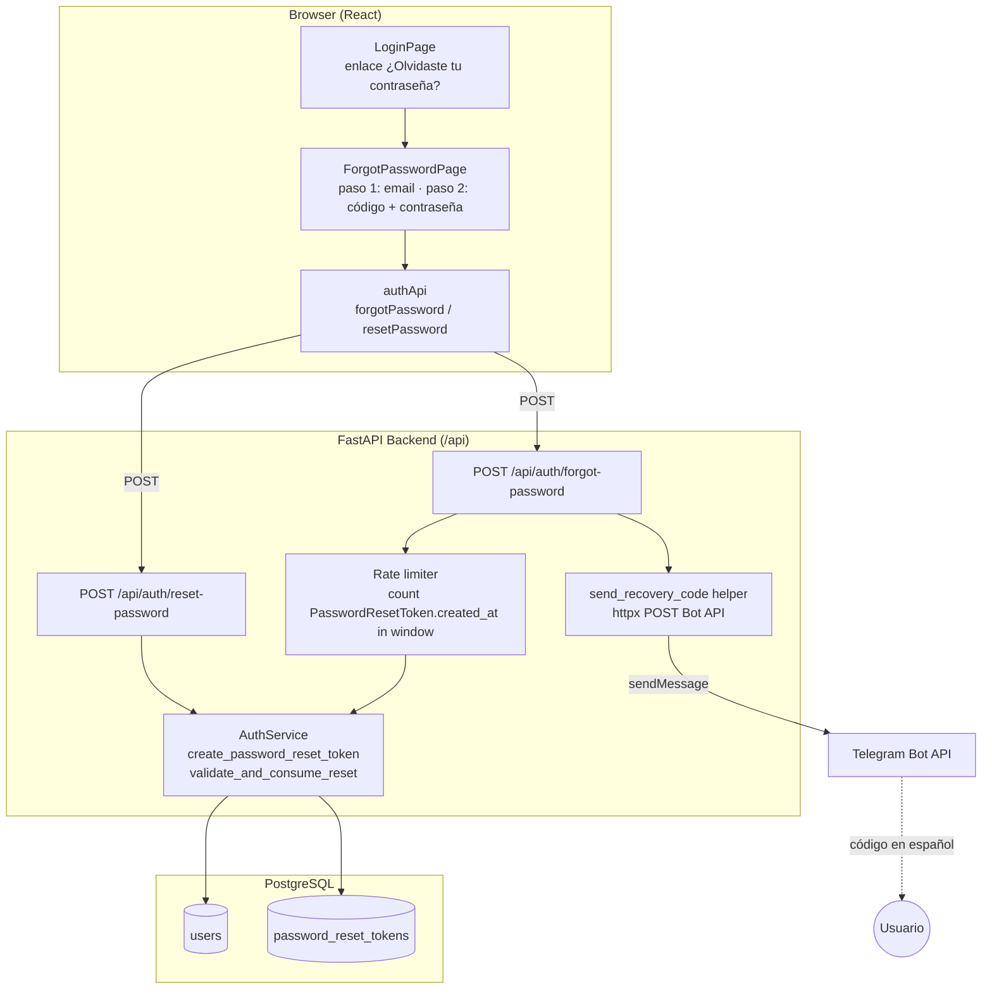

# Design Document: password-recovery-telegram

## Overview

This feature lets a HabitTrack user who forgot their password recover access using the Telegram bot as the delivery channel (there is no email service configured on the current Fly.io / Railway deployment). The flow has two frontend steps launched from the login screen:

1. **Request** — the user enters their email. If the email belongs to a `Linked_User` (a `User` whose `telegram_chat_id` is not null), the Backend generates a short-lived 6-digit `Recovery_Code`, persists a `PasswordResetToken`, and sends the code to the user's Telegram chat.
2. **Reset** — the user enters the received code plus a new password. The Backend validates the code and updates `password_hash`.

The design reuses existing project patterns:

- The single-use token-with-expiry model pattern from `LinkingToken` (`app/models/linking_token.py`).
- `AuthService` for bcrypt hashing (`hash_password` / `verify_password`) and token lifecycle methods (`app/services/auth_service.py`).
- The Telegram send mechanism used by the webhook (`_send` in `app/routes/telegram.py`, an `httpx` POST to the Bot API).
- The thin-controller route pattern in `app/routes/auth.py` (`AuthError` → `HTTPException`, `EmailStr` request bodies, response models).

Two cross-cutting security requirements shape the design:

- **Account-enumeration protection (Req 4)** — responses never reveal whether an email is registered or Telegram-linked. `POST /forgot-password` always returns `200` with an identical body; `POST /reset-password` returns an identical generic `400` for all enumeration-sensitive rejection reasons.
- **Rate limiting (Req 5)** — at most `Max_Requests_Per_Window` (3) recovery requests per email within a `Rate_Limit_Window` (15 minutes).

Users without Telegram linked cannot recover via this channel; that case is handled by an admin script and documented as out of scope.

All code and code comments are written in English; all user-facing strings (bot messages, API messages, frontend copy) are in Spanish, consistent with the product.

## Architecture



**Request flow (forgot-password):** browser → `authApi.forgotPassword` → `POST /api/auth/forgot-password` → rate-limit check → `AuthService.create_password_reset_token` (invalidate prior tokens, persist new token) → `send_recovery_code` (Telegram) → always returns identical generic `200`.

**Request flow (reset-password):** browser → `authApi.resetPassword` → `POST /api/auth/reset-password` → `AuthService.validate_and_consume_reset` (find user, find matching token, apply deterministic validation precedence, update `password_hash`, mark token used) → `200` on success or generic `400` / `429`.

## Components and Interfaces

### Backend

#### 1. Model — `app/models/password_reset_token.py`

New SQLAlchemy model following the `LinkingToken` pattern.

```python
class PasswordResetToken(Base):
    __tablename__ = "password_reset_tokens"

    id: Mapped[int] = mapped_column(primary_key=True)
    user_id: Mapped[int] = mapped_column(ForeignKey("users.id"), index=True)
    code_hash: Mapped[str] = mapped_column(String(255), index=True)  # bcrypt hash of the 6-digit code
    used: Mapped[bool] = mapped_column(Boolean, default=False, index=True)
    created_at: Mapped[datetime] = mapped_column(default=func.now())
    expires_at: Mapped[datetime]

    user: Mapped["User"] = relationship(back_populates="password_reset_tokens")
```

A `password_reset_tokens` relationship is added to `User` (mirroring `linking_tokens`):

```python
password_reset_tokens: Mapped[list["PasswordResetToken"]] = relationship(
    back_populates="user", cascade="all, delete-orphan"
)
```

Registration:
- Add `PasswordResetToken` to `app/models/__init__.py` (`import` + `__all__`).
- Add `password_reset_token` to the import list inside `init_db()` in `app/database.py` so `Base.metadata.create_all` registers the table.

**Design decision — store the code hashed, not in clear text (Req 1.2, Req 4).**
The `code` column is stored as `code_hash`, a bcrypt hash of the 6-digit code, rather than the plaintext code.

- *Tradeoff:* A 6-digit numeric code has only 1,000,000 possibilities and already expires in 15 minutes with a 3-requests-per-window rate limit, so plaintext storage would arguably be "acceptable." However, hashing costs almost nothing here (one bcrypt per generate, and a bounded set of bcrypt checks per reset), removes any at-rest exposure of live recovery codes, and matches the project's existing bcrypt usage in `AuthService`.
- *Consequence for lookup:* because bcrypt is salted, we cannot index-lookup by code. Instead we look up the user's candidate token(s) by `user_id` (which is indexed) and verify the submitted code against `code_hash` with `verify_password`. Given prior-token invalidation (Req 2), there is at most one non-used non-expired token per user, keeping the verification set tiny.
- *Decision:* **store `code_hash` (bcrypt).** Justified by low cost, at-rest safety, and consistency with the existing hashing approach.

#### 2. AuthService extensions — `app/services/auth_service.py`

```python
RESET_CODE_EXPIRY_MINUTES = 15
MIN_PASSWORD_LENGTH = 6
MAX_PASSWORD_LENGTH = 128

async def create_password_reset_token(
    self, db: AsyncSession, user: User
) -> str:
    """
    Invalidate the user's prior non-used, non-expired reset tokens (mark used=True),
    generate a fresh 6-digit numeric code, persist a PasswordResetToken with
    expires_at = utcnow() + RESET_CODE_EXPIRY_MINUTES, and return the PLAINTEXT code
    (needed once, to send via Telegram; only the bcrypt hash is stored).
    """
```

- Generates the code with a cryptographically secure RNG: `f"{secrets.randbelow(1_000_000):06d}"` (always exactly 6 digits, leading zeros preserved — Req 1.1).
- Marks all prior `PasswordResetToken` of the user with `used == False AND expires_at >= utcnow()` as `used = True` **before** inserting the new one (Req 2.1).
- Stores `code_hash = self.hash_password(code)`, `used = False`, `expires_at = utcnow() + 15 min` (Req 1.2).

```python
async def validate_and_consume_reset(
    self, db: AsyncSession, email: str, code: str, new_password: str
) -> None:
    """
    Reset a password using a recovery code. Raises AuthError with a category so the
    route can map to the correct status code and generic message.

    Deterministic rejection precedence (Req 3.4) — stop at the first that applies:
      (1) code does not match any of the user's tokens  -> AuthError("invalid")
      (2) matched token is used                          -> AuthError("invalid")
      (3) matched token is expired                       -> AuthError("invalid")
      (4) new_password length outside [6, 128]           -> AuthError("length")

    On success: update user.password_hash = hash_password(new_password) and set
    the matched token used = True.
    """
```

- Looks up the user by email. **Anti-enumeration + anti-timing (Req 4.2, Req 4.3):** if no user exists (or user has no candidate tokens), the method performs a dummy `verify_password` against a constant bcrypt hash so the timing profile matches the "user exists" path, then raises `AuthError("invalid")`.
- Loads the user's candidate tokens (`user_id == user.id`), ordered by `created_at DESC, id DESC`, and finds the token whose `code_hash` verifies against the submitted `code`. Because of invalidation (Req 2), the "valid" token is uniquely the most recent unused/unexpired one; the "no match" check applies to any token of the user.
- Applies the precedence rules; on the length rule it raises **without** marking the token used and **without** changing the password (Req 3.8).
- On success, updates `password_hash` and marks the matched token `used = True` (Req 3.1, 3.3, 3.9).

The route layer maps `AuthError` categories:
- `"invalid"` → `400` with the identical generic Spanish message (covers no-match, used, expired — Req 3.5, 3.6, 3.7, 4.2).
- `"length"` → `400` with a Spanish message stating the allowed length range (Req 3.8).

#### 3. Rate limiting

**Design decision — count persisted tokens in the window as the source of truth.**

Two approaches were considered:

- *In-memory dict* `email -> [timestamps]`, pruned to the 15-minute window, rejecting when `len >= 3`. Simple, zero DB cost, but **not correct across multiple workers/processes** (Fly.io / Railway may run more than one worker), because each worker keeps its own dict.
- *Database count* of `PasswordResetToken.created_at` within the last 15 minutes for the user. Works correctly across all workers because Postgres is the shared source of truth, and reuses a row we already create.

**Decision:** use the **database count** approach as the source of truth. Because rate limiting must apply even to nonexistent/unlinked emails (which do not create tokens — Req 1.4, 1.5), the count-based limiter is layered as follows:

- For the **request count**, count rows in `password_reset_tokens` created within the window for the resolved user. This naturally limits linked users who actually generate tokens.
- To also throttle repeated requests for **nonexistent or unlinked** emails (and to avoid probing), keep a lightweight in-memory per-email counter as a best-effort secondary guard, documented as best-effort only. The authoritative limit for token-generating requests is the DB count.

Rate-limit constants live in `AuthService` / `config` (`RESET_RATE_LIMIT_WINDOW_MINUTES = 15`, `RESET_MAX_REQUESTS_PER_WINDOW = 3`). When the limit is exceeded the route returns `429` with a Spanish message and no token is generated and no Telegram message is sent (Req 5.1, 5.2). When the window elapses, older `created_at` rows fall outside the window so the effective count resets (Req 5.3).

```python
async def is_rate_limited(self, db: AsyncSession, user: User | None) -> bool:
    """
    True if the user already has >= RESET_MAX_REQUESTS_PER_WINDOW reset tokens
    created within the last RESET_RATE_LIMIT_WINDOW_MINUTES. Returns False when
    user is None (nonexistent email); the best-effort in-memory guard handles those.
    """
```

#### 4. Telegram send helper

A module-level async helper mirrors `_send` in `app/routes/telegram.py` (an `httpx` POST to `https://api.telegram.org/bot{token}/sendMessage`). It is placed where `AuthService` / the route can call it (e.g. a small function in `app/services/auth_service.py` or a shared helper reused from the telegram module).

```python
async def send_recovery_code(chat_id: int, code: str) -> None:
    """Send the recovery code to the user's Telegram chat, in Spanish.
    Message contains the code and its validity in minutes (Req 6.1).
    Wrapped in try/except: on failure, log and return (Req 6.2)."""
    message = (
        f"🔐 Tu código de recuperación es: {code}\n"
        f"Válido por 15 minutos. Si no solicitaste este código, ignóralo."
    )
    # httpx POST to Bot API sendMessage; on exception log.warning and swallow.
```

The message-composition part is factored into a pure function `build_recovery_message(code: str) -> str` so it can be property-tested (Req 6.1) independently of the network call.

#### 5. Endpoints — `app/routes/auth.py`

Request/response schemas:

```python
class ForgotPasswordRequest(BaseModel):
    email: EmailStr

class ResetPasswordRequest(BaseModel):
    email: EmailStr
    code: str
    new_password: str

class GenericResponse(BaseModel):
    message: str
```

```python
@router.post("/forgot-password", response_model=GenericResponse)
async def forgot_password(body: ForgotPasswordRequest, db: AsyncSession = Depends(get_db)):
    # 1. Resolve user by email (may be None).
    # 2. Rate limit check -> 429 if exceeded (Req 5).
    # 3. If user is a Linked_User: create token + send_recovery_code (Req 1.1).
    #    Else: do nothing (Req 1.4, 1.5, 6.3).
    # 4. ALWAYS return identical GenericResponse, 200 (Req 1.3, 4.1).
    return GenericResponse(
        message="Si la cuenta existe y tiene Telegram vinculado, recibirás un código."
    )
```

- **422 for invalid email** is produced automatically by FastAPI/pydantic when `EmailStr` fails to validate (Req 1.7). No manual handling needed; FastAPI's validation error body is used.
- Telegram failures are swallowed inside `send_recovery_code`, so the endpoint still returns the identical `200` with the token persisted (Req 1.6, 6.2).

```python
@router.post("/reset-password", response_model=GenericResponse)
async def reset_password(body: ResetPasswordRequest, db: AsyncSession = Depends(get_db)):
    try:
        await auth_service.validate_and_consume_reset(
            db, body.email, body.code, body.new_password
        )
        return GenericResponse(message="Contraseña actualizada correctamente.")
    except AuthError as e:
        if str(e) == "length":
            raise HTTPException(
                status_code=status.HTTP_400_BAD_REQUEST,
                detail="La contraseña debe tener entre 6 y 128 caracteres.",
            )
        raise HTTPException(
            status_code=status.HTTP_400_BAD_REQUEST,
            detail="Código inválido o expirado.",
        )
```

No new router registration is needed — these endpoints are added to the existing `auth.router`, which `app/main.py` already mounts at `/api/auth` (note the existing `settings as settings_routes` alias remains untouched).

### Frontend

#### 1. `src/lib/api.ts` — extend `authApi`

```ts
export interface GenericMessageResponse {
  message: string
}

export const authApi = {
  // ...existing...
  forgotPassword: (email: string) =>
    api.post<GenericMessageResponse>('/auth/forgot-password', { email }),

  resetPassword: (email: string, code: string, new_password: string) =>
    api.post<GenericMessageResponse>('/auth/reset-password', {
      email,
      code,
      new_password,
    }),
}
```

#### 2. `src/pages/LoginPage.tsx` — add recovery link (Req 7.1)

Add a link with the exact text `¿Olvidaste tu contraseña?` below the login form (near the "¿No tienes cuenta?" line), routing to `/forgot-password`:

```tsx
<Link to="/forgot-password" className="text-accent hover:text-blue-400 transition-colors">
  ¿Olvidaste tu contraseña?
</Link>
```

#### 3. `src/pages/ForgotPasswordPage.tsx` — new two-step page (Req 7)

A single page component that manages a `step` state (`'request' | 'reset'`):

- **Step 1 (request):** email input + submit. On submit: `setLoading(true)`, disable button, call `authApi.forgotPassword(email)`. On `200` → advance to step 2 (Req 7.2, 7.3, 7.4).
- **Step 2 (reset):** code input + new-password input + submit. On submit: `setLoading(true)`, disable button, call `authApi.resetPassword(email, code, newPassword)`. On `200` → show Spanish success message and `navigate('/login')` within ≤5s (Req 7.5, 7.6).
- **Error handling (Req 7.7):** on any error status, show `err.response?.data?.detail ?? <fallback en español>`, stay on the current step, preserve entered field values **except** clear the password field.

State shape:

```tsx
const [step, setStep] = useState<'request' | 'reset'>('request')
const [email, setEmail] = useState('')
const [code, setCode] = useState('')
const [newPassword, setNewPassword] = useState('')
const [error, setError] = useState('')
const [success, setSuccess] = useState('')
const [loading, setLoading] = useState(false)
```

Redirect after success uses a short `setTimeout(() => navigate('/login'), <=5000)` (or immediate navigation after showing the message), satisfying the ≤5s bound (Req 7.6).

#### 4. `src/main.tsx` — public route

Add a **public** route (outside the `ProtectedRoute` block, alongside `/login` and `/register`):

```tsx
<Route path="/forgot-password" element={<ForgotPasswordPage />} />
```

## Data Models

### `PasswordResetToken`

| Field       | Type                     | Notes                                              |
|-------------|--------------------------|----------------------------------------------------|
| `id`        | Integer, PK              |                                                    |
| `user_id`   | Integer, FK → users.id, indexed | Owner of the recovery token                  |
| `code_hash` | String(255), indexed     | bcrypt hash of the 6-digit numeric code            |
| `used`      | Boolean, default False, indexed | Marked True on invalidation or successful reset |
| `created_at`| DateTime, default now()  | Used for rate-limit windowing and recency ordering |
| `expires_at`| DateTime                 | `created_at + 15 min`                              |

**Relationship:** `User.password_reset_tokens` ←→ `PasswordResetToken.user` (cascade delete-orphan, mirroring `linking_tokens`).

### Migration

**Design decision — provide an Alembic migration, consistent with the project.**

The project ships an Alembic setup (`alembic/`, `alembic.ini`, one existing revision) and `init_db()` also calls `Base.metadata.create_all`, which is idempotent. Two facts matter:

1. `Base.metadata.create_all` in `init_db()` **will already create** the `password_reset_tokens` table on startup once the model is registered in the `init_db` import list (this is how the other tables are ensured on the current deployment).
2. For consistency with the project's migration history and to keep environments reproducible, we **also add an autogenerated Alembic revision** that creates the table.

**Decision:** add an Alembic migration `create password_reset_tokens table` (generated via `alembic revision --autogenerate -m "create password_reset_tokens table"` and reviewed), and rely on `create_all` in `init_db` as the runtime safety net. The migration creates the table with the columns above and indexes on `user_id`, `code_hash`, and `used`, plus the FK to `users.id`. `_migrate_columns` is **not** used here because that helper only performs `ADD COLUMN` on existing tables; a whole new table is created by `create_all` / the migration.

## Correctness Properties

*A property is a characteristic or behavior that should hold true across all valid executions of a system — essentially, a formal statement about what the system should do. Properties serve as the bridge between human-readable specifications and machine-verifiable correctness guarantees.*

The backend recovery logic is pure enough (token lifecycle, validation precedence, hashing, rate counting) to warrant property-based testing with Hypothesis. Telegram delivery, HTTP status framework behavior, timing, and all frontend rendering are covered by example/component tests instead (see Testing Strategy).

### Property 1: Generated code format, expiry, and persisted fields

*For any* `Linked_User`, calling `create_password_reset_token` produces a code matching `^\d{6}$`, and persists a `PasswordResetToken` with the same `user_id`, `used == False`, and `expires_at == created_at + 15 minutes`.

**Validates: Requirements 1.1, 1.2**

### Property 2: Only the most recent token is valid (prior-token invalidation)

*For any* `Linked_User` and *any* sequence of `k >= 1` successive `create_password_reset_token` calls, after the last call exactly one token is non-used and non-expired (the most recent), and every previously generated token is `used == True`.

**Validates: Requirements 2.1, 2.2, 2.3**

### Property 3: Identical generic response for all forgot-password categories

*For any* valid-format email — whether it belongs to a linked user, an unlinked user, or no user — the `forgot-password` response body and HTTP status are identical.

**Validates: Requirements 1.3, 4.1**

### Property 4: No side effects for nonexistent or unlinked emails

*For any* valid-format email that matches no user or matches a user with a null `telegram_chat_id`, processing `forgot-password` creates no `PasswordResetToken` and invokes no Telegram send.

**Validates: Requirements 1.4, 1.5, 6.3**

### Property 5: Single-use token consumption

*For any* successful password reset, the matched `PasswordResetToken` becomes `used == True`, and a second reset attempt with the same code is rejected.

**Validates: Requirements 3.3**

### Property 6: Expired tokens are rejected without changing the password

*For any* token whose `expires_at` is in the past, a reset attempt using its code is rejected and the user's `password_hash` is unchanged.

**Validates: Requirements 3.7**

### Property 7: Out-of-range password length is rejected without consuming the token

*For any* new password whose length is `< 6` or `> 128`, the reset is rejected, the matched token remains `used == False`, and the user's `password_hash` is unchanged.

**Validates: Requirements 3.8**

### Property 8: Hashing correctness after reset

*For any* user, valid recovery code, and *any* pair of distinct old/new passwords, after a successful reset `verify_password(new_password, password_hash)` is `True` and `verify_password(old_password, password_hash)` is `False`.

**Validates: Requirements 3.1, 3.9**

### Property 9: Deterministic rejection precedence

*For any* combination of token state (matching/non-matching, used/unused, expired/valid) and new-password length, the reset rejection reported corresponds to the first failing condition in the fixed order: (1) no match, (2) used, (3) expired, (4) length.

**Validates: Requirements 3.4**

### Property 10: Identical generic error for enumeration-sensitive reset rejections

*For any* reset request rejected because the email matches no user, the code matches no token, the token is used, or the token is expired, the error body and HTTP status are identical across all four categories.

**Validates: Requirements 4.2**

### Property 11: Rate limiting after three requests with no side effects, then window reset

*For any* email, the first three `forgot-password` requests within a 15-minute window are accepted (`200`) and any additional request within that window returns `429` while creating no token and sending no Telegram message; once the window elapses, requests are accepted again.

**Validates: Requirements 5.1, 5.2, 5.3**

### Property 12: Recovery message contains the code and validity minutes

*For any* 6-digit code, `build_recovery_message(code)` returns a Spanish string that contains the code and its validity expressed in minutes.

**Validates: Requirements 6.1**

## Error Handling

| Scenario | Status | Body (Spanish) | Notes |
|----------|--------|----------------|-------|
| forgot-password, valid email (any category) | 200 | `"Si la cuenta existe y tiene Telegram vinculado, recibirás un código."` | Identical for all categories (Req 1.3, 4.1) |
| forgot-password, invalid email format | 422 | FastAPI/pydantic validation error (Spanish) | Automatic via `EmailStr`; no token, no Telegram (Req 1.7) |
| forgot-password, rate limit exceeded | 429 | `"Demasiadas solicitudes. Intenta de nuevo más tarde."` | No token, no Telegram (Req 5.1, 5.2) |
| forgot-password, Telegram send fails | 200 | same generic body | Token remains persisted; failure logged internally (Req 1.6, 6.2) |
| reset-password, success | 200 | `"Contraseña actualizada correctamente."` | Token marked used (Req 3.2, 3.3) |
| reset-password, no user / no match / used / expired | 400 | `"Código inválido o expirado."` | Identical generic message (anti-enumeration, Req 3.5–3.7, 4.2) |
| reset-password, password length out of range | 400 | `"La contraseña debe tener entre 6 y 128 caracteres."` | Token not consumed, password unchanged (Req 3.8) |

**Anti-enumeration (Req 4.1, 4.2):** The forgot path performs the same outward behavior regardless of whether the account exists; the reset path returns one identical `400` message for all enumeration-sensitive rejection reasons.

**Anti-timing (Req 4.3):** When the email does not resolve to a user (or the user has no candidate token), `validate_and_consume_reset` performs a dummy `verify_password` against a constant bcrypt hash so the response time for a nonexistent email approximates the time for a real one, keeping the variation within the ≤500 ms bound. This is documented as a design consideration; the dummy-work is applied on the reset path and the forgot path avoids branching that would create a measurable timing oracle.

**Telegram failures (Req 6.2):** `send_recovery_code` wraps the `httpx` call in `try/except`, logs a warning on failure, and returns normally so the caller's response is unaffected.

**Database consistency:** token invalidation and new-token insertion happen within the same request session; the existing `get_db` dependency commits on success and rolls back on exception.

## Testing Strategy

**Frameworks:** `pytest` + `pytest-asyncio` (auto mode) and **Hypothesis** for property-based tests (already present in the project, `.hypothesis/` directory). Frontend uses component tests for the two-step flow.

**Dual approach:**
- **Property tests** validate the universal backend properties above across many generated inputs.
- **Unit / example tests** validate specific examples, edge cases, framework behavior, and error paths.
- **Component tests** validate the frontend flow.

### Property-based tests (backend)

Each property test runs a **minimum of 100 iterations** and is tagged with a comment referencing its design property:

```
# Feature: password-recovery-telegram, Property 2: Only the most recent token is valid
```

Map of property → test:
- Property 1 → generate users, assert code regex + expiry + persisted fields.
- Property 2 → generate a user and `k` sequential token creations; assert single-valid invariant.
- Property 3 → generate emails across the three categories; assert identical response body + status. Telegram send is mocked.
- Property 4 → generate nonexistent/unlinked emails; assert zero token rows created and telegram mock not called.
- Property 5 → generate valid reset; assert token `used`, second attempt rejected.
- Property 6 → generate tokens with past `expires_at`; assert rejection and unchanged hash.
- Property 7 → generate passwords of length `<6` or `>128`; assert rejection, token unused, hash unchanged.
- Property 8 → generate distinct old/new password pairs; assert `verify_password` outcomes.
- Property 9 → generate combined failing states; assert the reported rejection matches the highest-precedence failure.
- Property 10 → generate the four enumeration-sensitive rejection categories; assert identical error body + status.
- Property 11 → drive requests with an injectable clock / controlled `created_at`; assert 200 for first 3, 429 afterward with no side effects, and acceptance after the window.
- Property 12 → generate 6-digit codes; assert `build_recovery_message` contains the code and the minutes.

Property tests use mocks for the Telegram Bot API (no real network calls) and an in-memory / test database session for token persistence.

### Unit / example tests (backend)

- **Telegram send failure (Req 1.6, 6.2):** mock `httpx` to raise; assert `forgot-password` still returns the identical `200` and the token row remains.
- **Invalid email 422 (Req 1.7):** post malformed emails; assert `422` and no token / no telegram.
- **Reset success message (Req 3.2):** happy-path reset; assert `200` and the Spanish success message.

### Component tests (frontend, Req 7)

- **7.1:** render `LoginPage`; assert the `¿Olvidaste tu contraseña?` link is present.
- **7.2:** navigating to `/forgot-password` shows the step-1 (email) form.
- **7.3 / 7.5:** with a mocked `authApi`, assert the submit button is disabled and a loading indicator shows while the request is pending.
- **7.4:** after a resolved `200` from `forgotPassword`, assert step 2 (code + new password) is shown.
- **7.6:** with fake timers, after a resolved `200` from `resetPassword`, assert the Spanish success message shows and navigation to `/login` occurs within 5s.
- **7.7:** with a mocked error response, assert the backend Spanish message is shown, the step is preserved, entered fields are kept, and the password field is cleared.

### Not property-tested (documented)

- **Timing bound (Req 4.3):** environment-dependent and flaky as an assertion; addressed via the anti-timing dummy-bcrypt design and, at most, a coarse smoke check rather than a property.
- **All Requirement 7 items:** UI rendering/interaction — covered by component tests, not properties.

## Requirements Traceability Summary

| Requirement | Covered by |
|-------------|-----------|
| 1.1, 1.2 | Model, `create_password_reset_token`, Property 1 |
| 1.3, 4.1 | `forgot-password` endpoint, Property 3 |
| 1.4, 1.5, 6.3 | `forgot-password` branching, Property 4 |
| 1.6, 6.2 | `send_recovery_code` try/except, example test |
| 1.7 | `EmailStr` / FastAPI 422, example test |
| 2.1, 2.2, 2.3 | `create_password_reset_token` invalidation, Property 2 |
| 3.1, 3.9 | `validate_and_consume_reset` hashing, Property 8 |
| 3.2 | reset success response, example test |
| 3.3 | token consumption, Property 5 |
| 3.4 | validation precedence, Property 9 |
| 3.5, 3.6, 3.7 | generic 400 / expiry, Properties 6, 10 |
| 3.8 | length rejection, Property 7 |
| 4.2 | generic reset error, Property 10 |
| 4.3 | anti-timing dummy bcrypt (documented) |
| 5.1, 5.2, 5.3 | DB-count rate limiter, Property 11 |
| 6.1 | `build_recovery_message`, Property 12 |
| 7.1–7.7 | LoginPage link, ForgotPasswordPage, main.tsx route, component tests |
